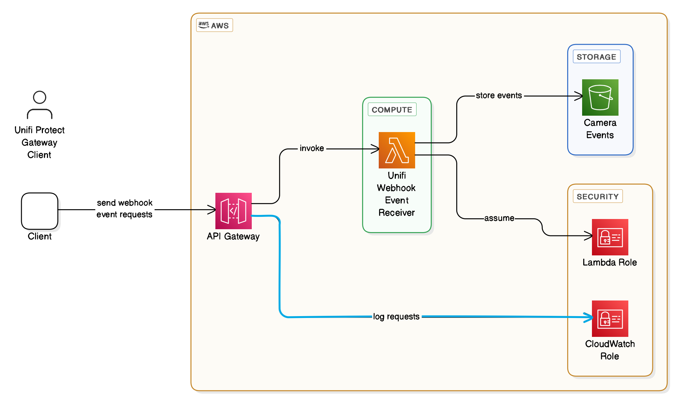

# Unifi Webhook Event Receiver (ARCHIVED)
**[MOVED HERE: https://github.com/engineerthefuture/unifi-protect-event-backup-api](https://github.com/engineerthefuture/unifi-protect-event-backup-api)**

## Description  

This project provides an AWS Lambda function that processes alarm event webhooks from a Unifi Dream Machine. It receives HTTP requests, extracts alarm details, and stores the data in an Amazon S3 bucket for further processing. The function is built using C# and leverages AWS services to handle incoming webhooks efficiently. Ideally Ubiquiti will implement the ability to generate and fetch the corresponding video for a webhook event so the video can be retrieved and stored for backup online. 

## Architecture  

The following diagram illustrates the high-level architecture of the Unifi Webhook Event Receiver:



## Key Techniques Used  

- **AWS Lambda with API Gateway**: Handles HTTP requests, including webhook payloads.  
- **[JSON Deserialization](https://www.newtonsoft.com/json/help/html/DeserializeObject.htm)**: Uses `Newtonsoft.Json` to parse incoming JSON payloads.  
- **[Environment Variables](https://learn.microsoft.com/en-us/dotnet/api/system.environment.getenvironmentvariable)**: Retrieves AWS configuration settings dynamically.  
- **[S3 File Uploading](https://docs.aws.amazon.com/AmazonS3/latest/userguide/upload-objects.html)**: Stores alarm event data as JSON files in an S3 bucket.  
- **[Pre-signed S3 URLs](https://docs.aws.amazon.com/AmazonS3/latest/userguide/PresignedUrlUploadObject.html)**: Allows temporary access to upload or retrieve video files.  
- **[Asynchronous Task Execution](https://learn.microsoft.com/en-us/dotnet/csharp/programming-guide/concepts/async/)**: Improves performance by handling I/O-bound operations efficiently.  

## Notable Dependencies  

- **[Newtonsoft.Json](https://www.newtonsoft.com/json)** – A powerful JSON framework for .NET used for parsing request bodies.  
- **[Amazon.Lambda.Core](https://www.nuget.org/packages/Amazon.Lambda.Core/)** – Provides logging and runtime context for AWS Lambda functions.  
- **[Amazon.S3 SDK](https://www.nuget.org/packages/AWSSDK.S3/)** – Interfaces with Amazon S3 for object storage.  

## Project Structure  

```sh
/UnifiWebhookEventReceiver
├── readme.md                               # Project documentation
├── UnifiWebhookEventReceiver.csproj        # C Sharp project file
├── UnifiWebhookEventReceiver.sln           # C Sharp solution file
├── /docs
    ├── UnifiWebhookEventReceiver_Arch.png  # Architecture diagram
├── /templates
    ├── cf-stack-cs.yaml                    # CloudFormation template for C Sharp .Net implementation
├── /src
    ├── UnifiWebookEventReceiver.cs         # Main Lambda function handler
    ├── Alarm.cs                            # Alarm event model definition
├── /test
    ├── UnifiWebookEventReceiverTests.cs    # Test class for main lambda function handler
    
```

- **UnifiWebookEventReceiver.cs**: Contains the main AWS Lambda function that handles API requests.  
- **Alarm.cs**: Defines the `Alarm` and `Trigger` models for handling webhook data.  

## Example Alarm Event JSON  

Here is an example of an alarm event JSON payload that the webhook receives:

```json
{
  "name": "Backup Alarm Event",
  "sources": [
    { "device": "28704E113F64", "type": "include" },
    { "device": "F4E2C67A2FE8", "type": "include" },
    { "device": "28704E113C44", "type": "include" },
    { "device": "28704E113F33", "type": "include" },
    { "device": "F4E2C677E20F", "type": "include" }
  ],
  "conditions": [
    { "type": null, "source": null },
    { "type": null, "source": null },
    { "type": null, "source": null },
    { "type": null, "source": null }
  ],
  "triggers": [
    {
      "key": "person",
      "device": "28704E113C44",
      "eventId": "67ad21e70035c703e4003f8d",
      "deviceName": "Side",
      "date": "2025-02-12T22:34:16",
      "eventKey": "28704E113C44_1739399656078.json",
      "videoKey": null,
      "presignedUrl": null
    }
  ],
  "timestamp": 1739399656078
}
```

This structure includes sources that triggered the alarm, conditions applied, and relevant metadata for processing the event.

## Example Alarm Event Webhook Request JSON  

The webhook sends requests with the following structure:

```json
{
    "alarm": {
        "name": "Backup Alarm Event",
        "sources": [
            { "device": "28704E113F64", "type": "include" },
            { "device": "F4E2C67A2FE8", "type": "include" },
            { "device": "28704E113C44", "type": "include" },
            { "device": "28704E113F33", "type": "include" },
            { "device": "F4E2C677E20F", "type": "include" }
        ],
        "conditions": [
            { "condition": { "type": "is", "source": "line_crossed" } },
            { "condition": { "type": "is", "source": "smart_loiter_detection" } },
            { "condition": { "type": "is", "source": "ring" } },
            { "condition": { "type": "is", "source": "motion" } },
            { "condition": { "type": "is", "source": "person" } },
            { "condition": { "type": "is", "source": "vehicle" } },
            { "condition": { "type": "is", "source": "animal" } },
            { "condition": { "type": "is", "source": "package" } }
        ],
        "triggers": [
            {
                "key": "motion",
                "device": "28704E113F33",
                "eventId": "67b389ab005ec703e40075a5",
                "zones": { "zone": [], "line": [], "loiter": [] }
            }
        ]
    },
    "timestamp": 1739819436108
}
```

This request includes alarm details, source devices, conditions, and trigger events associated with the webhook request.

