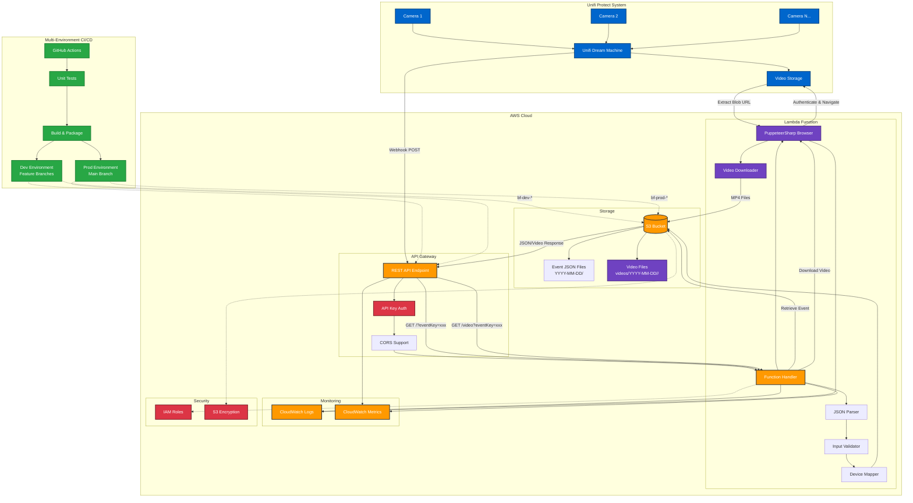

# Unifi Protect Event Backup API

An AWS Lambda function that receives and processes webhook events from Unifi Dream Machine Protect systems, storing alarm event data in S3 for backup and analysis. **Now featuring automated video download capabilities** using browser automation with PuppeteerSharp.

## 🆕 Latest Updates

- **🎥 Video Download Integration**: Automated video retrieval from Unifi Protect using browser automation
- **🌍 Multi-Environment Support**: Separate dev and prod environments with automatic deployment
- **🔄 Enhanced CI/CD**: GitHub Actions workflow supporting multiple branch deployments
- **📋 OpenAPI 3.0 Specification**: Complete API documentation with video endpoint support

## Overview

This serverless application provides a comprehensive backup and retrieval system for Unifi Protect alarm events and associated video content. When motion detection, intrusion alerts, or other configured events occur in your Unifi Protect system, webhooks are sent to this Lambda function which processes and stores both the event data and downloads the corresponding video files to Amazon S3.

## Features

### Core Functionality
- **Webhook Processing**: Receives real-time alarm events from Unifi Dream Machine
- **Video Download**: Automated video retrieval using PuppeteerSharp browser automation
- **Data Storage**: Stores event data and videos in S3 with organized folder structure
- **Device Mapping**: Maps device MAC addresses to human-readable names via environment variables
- **Event Retrieval**: RESTful API for retrieving stored alarm events and video presigned URLs

### Technical Features
- **Multi-Environment Deployment**: Separate dev and prod environments
- **CORS Support**: Cross-origin resource sharing for web client integration
- **Comprehensive Error Handling**: Detailed logging and error management
- **Scalable Architecture**: Serverless design that scales automatically
- **Browser Automation**: Headless Chrome integration for Unifi Protect navigation
- **Blob URL Processing**: Direct video blob extraction and MP4 conversion

## 🎥 Video Download Capabilities

### Automated Video Retrieval Process

The system now includes sophisticated browser automation to download video content directly from Unifi Protect:

1. **Browser Launch**: PuppeteerSharp launches headless Chrome instance
2. **Authentication**: Automated login to Unifi Protect using stored credentials  
3. **Navigation**: Programmatic navigation to specific event pages
4. **Video Extraction**: Direct blob URL access and video content download
5. **Format Conversion**: Conversion to MP4 format for standardized storage
6. **S3 Storage**: Organized storage in S3 with presigned URL generation

### Technical Implementation

- **🔐 Secure Authentication**: Credential-based login with error handling
- **📱 Responsive Navigation**: Handles Unifi Protect's modern web interface
- **💾 Blob Processing**: Direct blob URL extraction using JavaScript execution
- **🔄 Error Recovery**: Comprehensive error handling and retry mechanisms
- **📊 Progress Monitoring**: Detailed logging and screenshot capture for debugging

### Storage Organization

```
S3 Bucket Structure:
├── events/
│   └── YYYY-MM-DD/
│       └── {deviceMac}_{timestamp}.json
└── videos/
    └── YYYY-MM-DD/
        └── {deviceMac}_{timestamp}.mp4
```

## Architecture



### Enhanced Data Flow

1. **Event Detection**: Unifi cameras detect motion/intrusion events
2. **Webhook Trigger**: Unifi Dream Machine sends webhook to API Gateway
3. **Authentication**: API Gateway validates API key
4. **Event Processing**: Lambda function parses JSON, maps device names, validates data
5. **Event Storage**: Events stored in S3 with date-organized folder structure
6. **Video Download**: For video requests, PuppeteerSharp launches headless browser
7. **Browser Automation**: Authenticates with Unifi Protect and navigates to event
8. **Video Extraction**: Extracts blob URL and downloads video content as MP4
9. **Video Storage**: MP4 files stored in S3 under organized device folders
10. **Monitoring**: All operations logged to CloudWatch for observability
11. **Retrieval**: GET endpoints allow querying events and generating video presigned URLs
            METRICS[CloudWatch Metrics]
        end
        
        subgraph "Security"
            IAM[IAM Roles]
            ENCRYPT[S3 Encryption]
        end
    end
    
    subgraph "CI/CD Pipeline"
        GH[GitHub Actions]
        TEST[Unit Tests]
        BUILD[Build & Package]
        DEPLOY[CloudFormation Deploy]
    end
    
    %% Main data flow
    CAM1 --> UDM
    CAM2 --> UDM
    CAM3 --> UDM
    UDM -->|Webhook POST| API
    API --> AUTH
    AUTH --> CORS
    CORS --> HANDLER
    HANDLER --> PARSER
    PARSER --> VALIDATOR
    VALIDATOR --> MAPPER
    MAPPER --> S3
    S3 --> FOLDERS
    
    %% Monitoring flows
    HANDLER --> CW
    API --> METRICS
    HANDLER --> METRICS
    
    %% Security flows
    HANDLER -.-> IAM
    S3 -.-> ENCRYPT
    
    %% CI/CD flows
    GH --> TEST
    TEST --> BUILD
    BUILD --> DEPLOY
    DEPLOY -.-> API
    DEPLOY -.-> HANDLER
    
    %% GET endpoint for retrieval
    API -->|GET /?eventKey=xxx| HANDLER
    HANDLER -->|Retrieve| S3
    S3 -->|JSON Response| API
    
    %% Styling
    classDef aws fill:#ff9900,stroke:#232f3e,stroke-width:2px,color:#fff
    classDef unifi fill:#0066cc,stroke:#003d7a,stroke-width:2px,color:#fff
    classDef cicd fill:#28a745,stroke:#1e7e34,stroke-width:2px,color:#fff
    classDef security fill:#dc3545,stroke:#721c24,stroke-width:2px,color:#fff
    
    class API,HANDLER,S3,CW,METRICS aws
    class UDM,CAM1,CAM2,CAM3 unifi
    class GH,TEST,BUILD,DEPLOY cicd
    class IAM,ENCRYPT,AUTH security
```

### Data Flow

1. **Event Detection**: Unifi cameras detect motion/intrusion events
2. **Webhook Trigger**: Unifi Dream Machine sends webhook to API Gateway
3. **Authentication**: API Gateway validates API key
4. **Processing**: Lambda function parses JSON, maps device names, validates data
5. **Storage**: Events stored in S3 with date-organized folder structure
6. **Monitoring**: All operations logged to CloudWatch for observability
7. **Retrieval**: GET endpoint allows querying stored events by event key

## API Endpoints

### Core Endpoints

#### 1. **Webhook Receiver** - `POST /{stage}/alarmevent`
Receives alarm events from Unifi Protect systems
- **Purpose**: Process and store alarm event data
- **Authentication**: API Key required
- **Request**: JSON webhook payload from Unifi Dream Machine
- **Response**: Success confirmation with event key

#### 2. **Event Retrieval** - `GET /{stage}/?eventKey={eventKey}`
Retrieves stored alarm event data
- **Purpose**: Fetch specific alarm event JSON data
- **Authentication**: API Key required
- **Parameters**: `eventKey` - Event identifier (format: `{deviceMac}_{timestamp}.json`)
- **Response**: Complete alarm event JSON object

#### 3. **🆕 Video Download** - `GET /{stage}/video?eventKey={eventKey}`
Downloads video content for alarm events
- **Purpose**: Automated video retrieval from Unifi Protect
- **Authentication**: API Key required
- **Process**: Browser automation → Video extraction → S3 storage
- **Response**: Video metadata with S3 presigned URL for download

### OpenAPI 3.0 Specification

📋 **Complete API Documentation**: [openapi.yaml](openapi.yaml)

The full OpenAPI 3.0 specification is available in the [`openapi.yaml`](openapi.yaml) file and includes:

- **Complete endpoint documentation** with detailed request/response schemas
- **Interactive examples** for all supported event types (motion, person, vehicle detection)
- **Video endpoint documentation** with automation workflow details
- **Comprehensive error handling** documentation with specific error codes
- **Authentication and security** requirements
- **Validation patterns** for MAC addresses, timestamps, and event keys
- **Client code generation support** for multiple programming languages

### Using the OpenAPI Specification

#### **1. View Interactive Documentation**
```bash
# Swagger UI
npx swagger-ui-serve openapi.yaml

# Redoc
npx redoc-cli serve openapi.yaml
```

#### **2. Generate Client SDKs**
```bash
# TypeScript/JavaScript client
npx @openapitools/openapi-generator-cli generate \
  -i openapi.yaml \
  -g typescript-axios \
  -o ./generated-client

# Python client
openapi-generator-cli generate \
  -i openapi.yaml \
  -g python \
  -o ./python-client
```

#### **3. API Testing**
- Import `openapi.yaml` into **Postman**, **Insomnia**, or **Bruno**
- Use with **curl** for command-line testing
- Create mock servers with **Prism**: `npx @stoplight/prism mock openapi.yaml`

#### **4. Validation**
```bash
# Validate specification
npx swagger-parser validate openapi.yaml

# Lint for best practices
npx spectral lint openapi.yaml
```

### Quick Reference

#### POST /alarmevent
Processes incoming alarm webhook events from Unifi Protect.

**Request Body**: JSON alarm event from Unifi Protect
**Response**: Success confirmation with event details

#### GET /?eventKey={key}
Retrieves a stored alarm event by its unique key.

**Parameters**: 
- `eventKey`: Unique event identifier (format: `{deviceMac}_{timestamp}.json`)

**Response**: JSON alarm event data

#### OPTIONS /alarmevent
Handles CORS preflight requests for web client support.

## Setup and Deployment

This project supports **multi-environment deployment** with automated CI/CD via GitHub Actions. Deploy to development environments from feature branches and production from the main branch.

### 🌍 Multi-Environment Support

| Environment | Trigger | Stack Name | S3 Buckets | Lambda Function |
|-------------|---------|------------|------------|-----------------|
| **Development** | Feature branches<br/>`feature/*`, `bugfix/*`, `hotfix/*`, `develop` | `bf-dev-unifi-protect-event-backup-api` | `bf-dev-s3-*` | `bf-dev-lambda-unifi-protect-event-backup-api` |
| **Production** | Main branch<br/>`main` | `bf-prod-unifi-protect-event-backup-api` | `bf-prod-s3-*` | `bf-prod-lambda-unifi-protect-event-backup-api` |

### Prerequisites

- .NET 8.0 SDK
- AWS CLI configured with appropriate permissions  
- AWS Lambda Tools for .NET (for manual deployment)
- GitHub repository with Actions enabled (for automated deployment)
- **🆕 Unifi Protect Credentials** for video download functionality

## Automated Deployment (Recommended)

### 🔄 Multi-Environment GitHub Actions Workflow

The project includes a comprehensive CI/CD pipeline that automatically builds, tests, and deploys to the appropriate environment based on the branch:

- **🚀 Production Deployment**: Push to `main` branch → Production environment
- **🧪 Development Deployment**: Push to any other branch → Development environment

#### Workflow Features

- **Environment Detection**: Automatically determines target environment based on branch name
- **Quality Gate**: Runs unit tests and blocks deployment if any tests fail
- **Multi-Stage Pipeline**: Separate build and deploy jobs for better error isolation  
- **Artifact Management**: Preserves build outputs and test results
- **AWS Integration**: Uses OIDC for secure AWS authentication
- **Infrastructure as Code**: Complete CloudFormation-based infrastructure management
- **🆕 Video Download Testing**: Validates PuppeteerSharp browser automation functionality

#### Required GitHub Repository Variables

Configure these variables in your GitHub repository settings (Settings → Secrets and variables → Actions → Variables):

| Variable | Description | Example |
|----------|-------------|---------|
| `AWS_ACCOUNT_ID` | Your AWS account ID | `123456789012` |
| `OIDC_ROLE_NAME` | IAM role for GitHub OIDC | `GitHubActionsRole` |
| `OWNER_NAME` | Resource owner name | `Brent Foster` |
| `APP_NAME` | Application name | `unifi-protect-event-backup-api` |
| `APP_DESCRIPTION` | Application description | `Unifi webhook alarm event processing and backup API` |

#### Required GitHub Repository Secrets

Configure these secrets in your GitHub repository settings (Settings → Secrets and variables → Actions → Secrets):

| Secret | Description | Required For |
|--------|-------------|--------------|
| `UNIFI_USERNAME` | Unifi Protect username | Video download functionality |
| `UNIFI_PASSWORD` | Unifi Protect password | Video download functionality |
| `APP_DESCRIPTION` | Application description | `Unifi webhook alarm event processing and backup API` |

#### OIDC IAM Role Setup

Create an IAM role in AWS with the following trust policy for GitHub Actions:

```json
{
  "Version": "2012-10-17",
  "Statement": [
    {
      "Effect": "Allow",
      "Principal": {
        "Federated": "arn:aws:iam::YOUR_ACCOUNT_ID:oidc-provider/token.actions.githubusercontent.com"
      },
      "Action": "sts:AssumeRole",
      "Condition": {
        "StringEquals": {
          "token.actions.githubusercontent.com:sub": "repo:YOUR_USERNAME/unifi-protect-event-backup-api:ref:refs/heads/main",
          "token.actions.githubusercontent.com:aud": "sts.amazonaws.com"
        },
        "StringLike": {
          "token.actions.githubusercontent.com:sub": "repo:engineerthefuture/*"
        }
      }
    }
  ]
}
```

Attach these policies to the role:
- `CloudFormationFullAccess`
- `IAMFullAccess`
- `AmazonS3FullAccess`
- `AWSLambdaFullAccess`
- `AmazonAPIGatewayInvokeFullAccess`

#### Workflow Execution

1. **Trigger**: Push code to the `main` branch
2. **Build Stage**:
   - Checkout code
   - Setup .NET 8.0
   - Restore dependencies (main + test projects)
   - Build projects in Release configuration
   - **Run unit tests** ⚠️ **DEPLOYMENT GATE**
   - Generate test reports and artifacts (with fallback for permission issues)
   - Package Lambda function
   - Upload to S3 deployment bucket
3. **Deploy Stage** (only if build succeeds):
   - Deploy CloudFormation stack
   - Update Lambda function code

#### Test Result Integration

- Test results are displayed in GitHub's Actions UI (when permissions allow)
- Failed tests prevent deployment automatically
- Test artifacts are preserved for download
- Clear status indicators show test pass/fail state
- Fallback test summary displayed in workflow logs if reporter fails

**Note**: The workflow includes enhanced permissions (`checks: write`, `pull-requests: write`) and fallback mechanisms to handle potential test reporter permission issues.

**Quality Assurance**: The codebase has been updated to eliminate all nullable reference type warnings while maintaining proper error handling and test compatibility.

## CloudFormation Infrastructure

### Infrastructure Components

The CloudFormation template (`templates/cf-stack-cs.yaml`) creates a complete serverless infrastructure:

#### Core Resources

1. **Lambda Function**
   - Runtime: .NET 8.0
   - Memory: 128 MB
   - Timeout: 30 seconds
   - Environment variables for configuration

2. **API Gateway**
   - RESTful API with proxy integration
   - CORS support for web clients
   - API key authentication
   - Request/response logging
   - Rate limiting and throttling

3. **S3 Bucket**
   - Encrypted storage for alarm events
   - Public access blocked for security
   - Organized folder structure by date

4. **IAM Roles**
   - Lambda execution role with minimal required permissions
   - API Gateway CloudWatch logging role

#### Template Parameters

| Parameter | Default | Description |
|-----------|---------|-------------|
| `AppName` | `unifi-protect-event-backup-api` | Application name |
| `EnvPrefix` | `prod` | Environment prefix |
| `BucketName` | `bf-prod-s3-unifi-protect-event-backup-api` | S3 bucket for events |
| `BucketNameDeployment` | `bf-prod-s3-deployments` | S3 bucket for deployments |
| `FunctionName` | `bf-prod-lambda-unifi-protect-event-backup-api` | Lambda function name |
| `OwnerName` | `Brent Foster` | Resource owner |
| `AppDescription` | `Unifi webhook alarm event processing and backup API` | Description |

#### Resource Naming Convention

Resources follow a consistent naming pattern: `{GlobalPrefix}-{EnvPrefix}-{ResourceType}-{AppName}`

Example:
- Lambda: `bf-prod-lambda-unifi-protect-event-backup-api`
- S3 Bucket: `bf-prod-s3-unifi-protect-event-backup-api`
- API Gateway: `bf-prod-lambda-unifi-protect-event-backup-api-API`

#### Environment Variables (Auto-configured)

The CloudFormation template automatically configures these Lambda environment variables:

| Variable | Source | Purpose |
|----------|--------|---------|
| `FunctionName` | CloudFormation parameter | Lambda function identification |
| `DeployedEnv` | CloudFormation parameter | Environment identifier |
| `StorageBucket` | S3 bucket name | Event storage location |
| `ApiKey` | Generated API key | API Gateway authentication |
| `DevicePrefix` | Fixed value: `DeviceMac` | Device mapping prefix |
| `DeviceMac{MacAddress}` | Template values | Device name mappings |

#### Pre-configured Device Mappings

The template includes example device mappings:

```yaml
DeviceMac28704E113F64: "Backyard East"
DeviceMacF4E2C67A2FE8: "Front"
DeviceMac28704E113C44: "Side"
DeviceMac28704E113F33: "Backyard West"
DeviceMacF4E2C677E20F: "Door"
```

Update these in the CloudFormation template to match your Unifi device MAC addresses.

## 🧪 Testing

### Unit Testing

```bash
# Run unit tests only
dotnet test test/ --verbosity normal

# Generate test coverage report
dotnet test test/ --collect:"XPlat Code Coverage"
```

### API Testing Examples

#### Test Webhook Endpoint
```bash
curl -X POST "https://your-api-gateway-url/prod/alarmevent" \
  -H "Content-Type: application/json" \
  -H "x-api-key: your-api-key" \
  -d '{
    "eventLocalLink": "https://192.168.0.1/protect/events/event/123",
    "triggers": [{
      "device": "F4E2C67A2FE8",
      "key": "motion",
      "eventId": "test-event-123"
    }],
    "timestamp": 1755383421797
  }'
```

#### Test Video Download Endpoint  
```bash
curl -X GET "https://your-api-gateway-url/prod/video?eventKey=F4E2C67A2FE8_1755383421797.json" \
  -H "x-api-key: your-api-key"
```

## Manual Deployment (Alternative)

### Environment Variables

If deploying manually, configure these environment variables in your Lambda function:

| Variable | Description | Example |
|----------|-------------|---------|
| `StorageBucket` | S3 bucket name for storing events | `my-unifi-events-bucket` |
| `DevicePrefix` | Prefix for device name mapping variables | `DeviceMac` |
| `DeployedEnv` | Environment identifier | `prod` |
| `FunctionName` | Lambda function name | `UnifiProtectEventReceiver` |

### Device Name Mapping

Map device MAC addresses to human-readable names using environment variables:

```
DeviceMacAA:BB:CC:DD:EE:FF = "Front Door Camera"
DeviceMac11:22:33:44:55:66 = "Backyard Camera"
```

### Manual Build and Deploy

1. **Build the project**:
   ```bash
   dotnet build --configuration Release
   ```

2. **Run tests**:
   ```bash
   dotnet test test/ --configuration Release
   ```

3. **Deploy CloudFormation stack**:
   ```bash
   aws cloudformation deploy \
     --template-file templates/cf-stack-cs.yaml \
     --stack-name unifi-protect-event-backup-api \
     --capabilities CAPABILITY_IAM CAPABILITY_NAMED_IAM \
     --parameter-overrides \
       OwnerName="Your Name" \
       AppName="unifi-protect-event-backup-api" \
       AppDescription="Unifi webhook event processing"
   ```

4. **Deploy Lambda function**:
   ```bash
   dotnet lambda deploy-function
   ```

## Post-Deployment Configuration

### Retrieving Deployment Information

After successful deployment, you'll need to configure Unifi Protect with the API endpoint and key.

#### Get API Gateway Endpoint

From CloudFormation outputs:
```bash
aws cloudformation describe-stacks \
  --stack-name bf-prod-unifi-protect-event-backup-api \
  --query 'Stacks[0].Outputs[?OutputKey==`POSTUnfiWebhookAlarmEventEndpoint`].OutputValue' \
  --output text
```

#### Get API Key

```bash
aws apigateway get-api-keys \
  --query 'items[?name==`bf-prod-lambda-unifi-protect-event-backup-api-ApiKey`].value' \
  --include-values \
  --output text
```

### Unifi Protect Configuration

1. **Open Unifi Protect web interface**
2. **Navigate to Settings → Integrations → Webhooks**
3. **Add a new webhook**:
   - **URL**: Use the API Gateway endpoint from CloudFormation outputs
   - **API Key**: Add as `X-API-Key` header
   - **Events**: Configure motion detection, intrusion, person detection, etc.
4. **Test the webhook** to ensure connectivity

Example webhook URL format:
```
https://abcd1234.execute-api.us-east-1.amazonaws.com/prod/alarmevent
```

### Testing the Deployment

#### Test with curl

```bash
# Test OPTIONS (CORS preflight)
curl -X OPTIONS \
  -H "X-API-Key: YOUR_API_KEY" \
  https://your-api-gateway-url/prod/alarmevent

# Test with sample alarm event
curl -X POST \
  -H "Content-Type: application/json" \
  -H "X-API-Key: YOUR_API_KEY" \
  -d '{"alarm":{"name":"Test Alarm","triggers":[{"key":"motion","device":"AA:BB:CC:DD:EE:FF","eventId":"test123"}]},"timestamp":1640995200000}' \
  https://your-api-gateway-url/prod/alarmevent
```

#### Verify S3 Storage

Check that events are being stored:
```bash
aws s3 ls s3://bf-prod-s3-unifi-protect-event-backup-api/ --recursive
```

## Deployment Monitoring and Maintenance

### GitHub Actions Monitoring

- **Action Status**: Monitor workflow runs in the Actions tab
- **Test Reports**: Review test results and coverage
- **Deployment Logs**: Check CloudFormation deployment progress
- **Artifacts**: Download build outputs and test results

### AWS Resource Monitoring

#### CloudWatch Logs

```bash
# Lambda function logs
aws logs describe-log-groups --log-group-name-prefix "/aws/lambda/bf-prod-lambda-unifi-protect-event-backup-api"

# API Gateway logs
aws logs describe-log-groups --log-group-name-prefix "API-Gateway-Execution-Logs"
```

#### CloudWatch Metrics

Monitor these key metrics:
- **Lambda Duration**: Function execution time
- **Lambda Errors**: Error count and rate
- **API Gateway 4XXError**: Client error rate
- **API Gateway 5XXError**: Server error rate
- **API Gateway Count**: Request volume

#### S3 Storage Monitoring

```bash
# Check bucket size and object count
aws cloudwatch get-metric-statistics \
  --namespace AWS/S3 \
  --metric-name BucketSizeBytes \
  --dimensions Name=BucketName,Value=bf-prod-s3-unifi-protect-event-backup-api \
  --start-time 2024-01-01T00:00:00Z \
  --end-time 2024-12-31T23:59:59Z \
  --period 86400 \
  --statistics Average
```

### Deployment Updates

#### Automated Updates
- Push code changes to the `main` branch
- GitHub Actions automatically builds, tests, and deploys
- Monitor the Actions tab for deployment status

#### Manual Updates
```bash
# Update CloudFormation stack with parameter changes
aws cloudformation update-stack \
  --stack-name bf-prod-unifi-protect-event-backup-api \
  --template-body file://templates/cf-stack-cs.yaml \
  --parameters ParameterKey=DeviceMacNEWDEVICE,ParameterValue="New Camera Name" \
  --capabilities CAPABILITY_IAM CAPABILITY_NAMED_IAM
```

### Troubleshooting Deployments

#### Common Issues

1. **GitHub Actions OIDC Authentication Fails**
   - Verify IAM role trust policy
   - Check repository variables are correctly set
   - Ensure OIDC provider is configured in AWS

2. **CloudFormation Stack Rollback**
   - Check CloudFormation events in AWS console
   - Verify IAM permissions for stack operations
   - Check parameter validation and resource limits

3. **Lambda Function Update Fails**
   - Verify S3 bucket permissions
   - Check Lambda function exists and is accessible
   - Verify deployment package is valid

4. **API Gateway Issues**
   - Test API key authentication
   - Check CORS configuration
   - Verify Lambda integration permissions

#### Debugging Commands

```bash
# Check CloudFormation stack status
aws cloudformation describe-stacks --stack-name bf-prod-unifi-protect-event-backup-api

# View CloudFormation events
aws cloudformation describe-stack-events --stack-name bf-prod-unifi-protect-event-backup-api

# Test Lambda function directly
aws lambda invoke \
  --function-name bf-prod-lambda-unifi-protect-event-backup-api \
  --payload '{"body":"{\"alarm\":{\"triggers\":[{\"key\":\"test\",\"device\":\"test\",\"eventId\":\"test\"}]}}"}' \
  response.json

# Check API Gateway deployment
aws apigateway get-deployments --rest-api-id YOUR_API_ID
```

## Data Structure

### Incoming Webhook Format

Unifi Protect sends webhook requests with the following structure:

```json
{
    "alarm": {
        "name": "Backup Alarm Event",
        "sources": [
            { "device": "28704E113F64", "type": "include" },
            { "device": "F4E2C67A2FE8", "type": "include" }
        ],
        "conditions": [
            { "condition": { "type": "is", "source": "motion" } },
            { "condition": { "type": "is", "source": "person" } }
        ],
        "triggers": [
            {
                "key": "motion",
                "device": "28704E113F33",
                "eventId": "67b389ab005ec703e40075a5",
                "zones": { "zone": [], "line": [], "loiter": [] }
            }
        ]
    },
    "timestamp": 1739819436108
}
```

### Stored Event Format

Events are processed and stored in S3 as JSON files with additional metadata:

```json
{
  "name": "Motion Detection Alert",
  "timestamp": 1704067200000,
  "triggers": [
    {
      "key": "motion",
      "device": "AA:BB:CC:DD:EE:FF",
      "eventId": "12345",
      "deviceName": "Front Door Camera",
      "date": "2024-01-01T00:00:00",
      "eventKey": "AA:BB:CC:DD:EE:FF_1704067200000.json"
    }
  ],
  "sources": [...],
  "conditions": [...],
  "eventPath": "/path/to/event",
  "eventLocalLink": "https://udm.local/protect/events/..."
}
```

### S3 Storage Organization

```
my-unifi-events-bucket/
├── 2024-01-01/
│   ├── AA:BB:CC:DD:EE:FF_1704067200000.json
│   └── 11:22:33:44:55:66_1704070800000.json
├── 2024-01-02/
│   └── AA:BB:CC:DD:EE:FF_1704153600000.json
└── ...
```

## Development

### Project Structure

```
├── src/
│   ├── UnifiWebhookEventReceiver.cs    # Main Lambda handler
│   └── Alarm.cs                        # Data models
├── test/
│   ├── UnifiWebhookEventReceiverTests.cs   # Unit tests
│   └── UnifiWebhookEventReceiverTests.csproj
├── templates/
│   └── cf-stack-cs.yaml               # CloudFormation template
├── UnifiWebhookEventReceiver.csproj   # Main project file
└── UnifiWebhookEventReceiver.sln      # Solution file
```

### Key Technologies Used

- **AWS Lambda with API Gateway**: Handles HTTP requests and webhook payloads
- **[JSON Deserialization](https://www.newtonsoft.com/json/help/html/DeserializeObject.htm)**: Uses `Newtonsoft.Json` to parse incoming JSON payloads
- **[Environment Variables](https://learn.microsoft.com/en-us/dotnet/api/system.environment.getenvironmentvariable)**: Retrieves AWS configuration settings dynamically
- **[S3 File Uploading](https://docs.aws.amazon.com/AmazonS3/latest/userguide/upload-objects.html)**: Stores alarm event data as JSON files in an S3 bucket
- **[Asynchronous Task Execution](https://learn.microsoft.com/en-us/dotnet/csharp/programming-guide/concepts/async/)**: Improves performance by handling I/O-bound operations efficiently

### Dependencies

- **[Newtonsoft.Json](https://www.newtonsoft.com/json)** – JSON framework for .NET used for parsing request bodies
- **[Amazon.Lambda.Core](https://www.nuget.org/packages/Amazon.Lambda.Core/)** – Provides logging and runtime context for AWS Lambda functions
- **[Amazon.S3 SDK](https://www.nuget.org/packages/AWSSDK.S3/)** – Interfaces with Amazon S3 for object storage
- **[Amazon.Lambda.APIGatewayEvents](https://www.nuget.org/packages/Amazon.Lambda.APIGatewayEvents/)** – API Gateway integration types

### Running Tests

```bash
# Run all tests
dotnet test

# Run with coverage
dotnet test --collect:"XPlat Code Coverage"
```

### Local Development

The function can be tested locally using the AWS Lambda Test Tool:

```bash
dotnet lambda-test-tool-3.1
```

## Security and Access Control

### Infrastructure Security

The CloudFormation template implements security best practices:

#### S3 Bucket Security
- **Server-side encryption** with AES-256
- **Public access blocked** at bucket level
- **IAM-based access control** for Lambda function only
- **Bucket policy** prevents unauthorized access

#### API Gateway Security
- **API Key authentication** required for all endpoints
- **Rate limiting** and throttling to prevent abuse
- **Request/response logging** for audit trails
- **CORS configuration** for controlled cross-origin access

#### Lambda Function Security
- **Minimal IAM permissions** following principle of least privilege
- **VPC isolation** (can be configured if needed)
- **Environment variable encryption** at rest
- **Function-level logging** and monitoring

#### IAM Role Permissions

The Lambda execution role includes only necessary permissions:

```json
{
  "Version": "2012-10-17",
  "Statement": [
    {
      "Effect": "Allow",
      "Action": [
        "s3:GetObject",
        "s3:PutObject",
        "s3:ListBucket"
      ],
      "Resource": [
        "arn:aws:s3:::your-bucket-name",
        "arn:aws:s3:::your-bucket-name/*"
      ]
    },
    {
      "Effect": "Allow",
      "Action": [
        "logs:CreateLogGroup",
        "logs:CreateLogStream",
        "logs:PutLogEvents"
      ],
      "Resource": "arn:aws:logs:*:*:*"
    }
  ]
}
```

#### GitHub Actions Security

- **OIDC authentication** eliminates long-lived AWS credentials
- **Temporary tokens** with limited scope and duration
- **Branch-based access control** restricts deployments to main branch
- **Repository secrets** protect sensitive configuration

### Access Control Best Practices

1. **API Key Management**
   - Rotate API keys regularly
   - Monitor API key usage in CloudWatch
   - Use different keys for different environments

2. **Network Security**
   - Consider VPC deployment for enhanced isolation
   - Use WAF for additional API protection
   - Monitor unusual traffic patterns

3. **Data Security**
   - Event data is encrypted at rest in S3
   - Implement retention policies for compliance
   - Consider additional encryption for sensitive data

4. **Monitoring and Alerting**
   - Set up CloudWatch alarms for error rates
   - Monitor failed authentication attempts
   - Alert on unusual API usage patterns

### Compliance Considerations

- **Data retention**: Configure S3 lifecycle policies
- **Audit logging**: CloudTrail integration for API calls
- **Access logging**: All requests logged to CloudWatch
- **Change tracking**: CloudFormation tracks infrastructure changes

## Monitoring and Logs

### CloudWatch Integration

- **Function Logs**: All Lambda execution logs automatically sent to CloudWatch
- **API Gateway Logs**: Request/response logging with configurable detail level
- **Custom Metrics**: Application-specific metrics for monitoring
- **Error Tracking**: Failed requests and exceptions logged with detailed error messages

### Monitoring Dashboard

Key metrics to monitor:

1. **Lambda Metrics**:
   - Duration, Error count, Throttles
   - Concurrent executions, Dead letter queue errors

2. **API Gateway Metrics**:
   - Request count, Error rates (4XX/5XX)
   - Integration latency, Client errors

3. **S3 Metrics**:
   - Object count, Bucket size
   - Request metrics, Error rates

### Alerting Setup

Example CloudWatch alarms:

```bash
# High error rate alarm
aws cloudwatch put-metric-alarm \
  --alarm-name "Lambda-HighErrorRate" \
  --alarm-description "Lambda function error rate > 5%" \
  --metric-name Errors \
  --namespace AWS/Lambda \
  --statistic Sum \
  --period 300 \
  --threshold 5 \
  --comparison-operator GreaterThanThreshold

# API Gateway 5XX errors
aws cloudwatch put-metric-alarm \
  --alarm-name "API-Gateway-ServerErrors" \
  --alarm-description "API Gateway 5XX error rate > 1%" \
  --metric-name 5XXError \
  --namespace AWS/ApiGateway \
  --statistic Sum \
  --period 300 \
  --threshold 1 \
  --comparison-operator GreaterThanThreshold
```

## Troubleshooting

### Deployment Issues

#### GitHub Actions Failures

1. **Unit Tests Failing**
   - Check test output in Actions tab
   - Run tests locally: `dotnet test test/`
   - Fix failing tests before pushing to main branch

2. **OIDC Authentication Errors**
   ```
   Error: Could not assume role with OIDC
   ```
   - Verify IAM role exists and has correct trust policy
   - Check repository variables are set correctly
   - Ensure OIDC provider is configured in your AWS account

3. **CloudFormation Deployment Failures**
   ```
   Error: Stack CREATE_FAILED
   ```
   - Check CloudFormation events in AWS Console
   - Verify IAM permissions for stack operations
   - Check for resource naming conflicts
   - Validate template parameter constraints

4. **Lambda Update Failures**
   ```
   Error: The role defined for the function cannot be assumed by Lambda
   ```
   - Verify IAM role trust policy includes `lambda.amazonaws.com`
   - Check role permissions include Lambda execution permissions

4. **Test Reporter Permission Issues**
   ```
   Error: HttpError: Resource not accessible by integration
   ```
   **Causes and Solutions:**
   - **Missing Permissions**: Ensure workflow has `checks: write` and `pull-requests: write` permissions
   - **Repository Settings**: Verify Actions can create check runs in repository settings
   - **Branch Protection**: Check that branch protection rules don't block check creation
   - **Token Scope**: The default `GITHUB_TOKEN` may have insufficient permissions
   
   **Workarounds:**
   - The workflow includes `continue-on-error: true` for the test reporter step
   - Test results are still uploaded as artifacts
   - Test summary is displayed in workflow logs
   - Tests still block deployment on failure regardless of reporter issues

#### Runtime Issues

1. **Lambda Function Errors**
   ```
   ERROR: Request failed with status code 500
   ```
   - Check CloudWatch Logs for detailed error messages
   - Verify environment variables are correctly set
   - Test function with sample payloads

2. **S3 Access Denied**
   ```
   ERROR: Access Denied when writing to S3
   ```
   - Verify Lambda execution role has S3 permissions
   - Check bucket name matches environment variable
   - Ensure bucket exists and is in the correct region

3. **API Gateway Issues**
   ```
   ERROR: Missing Authentication Token
   ```
   - Verify API key is included in request headers
   - Check API key is active and associated with usage plan
   - Validate request URL and method

4. **Device Mapping Issues**
   ```
   WARNING: Device name not found for MAC address
   ```
   - Check environment variables for device mappings
   - Verify MAC address format matches expected pattern
   - Update CloudFormation template with correct device mappings

### Operational Issues

1. **High Error Rates**
   - Check CloudWatch metrics for Lambda errors
   - Review API Gateway logs for failed requests
   - Monitor S3 operation failures

2. **Performance Issues**
   - Check Lambda duration metrics
   - Monitor API Gateway latency
   - Review S3 request patterns

3. **Storage Issues**
   - Monitor S3 bucket size and object count
   - Check for failed S3 uploads
   - Verify date-based folder structure

### Debugging Commands

```bash
# Check GitHub Actions workflow status
gh run list --repo your-username/unifi-protect-event-backup-api

# View CloudFormation stack details
aws cloudformation describe-stacks \
  --stack-name bf-prod-unifi-protect-event-backup-api

# Check Lambda function configuration
aws lambda get-function-configuration \
  --function-name bf-prod-lambda-unifi-protect-event-backup-api

# View recent Lambda logs
aws logs tail /aws/lambda/bf-prod-lambda-unifi-protect-event-backup-api \
  --follow

# Test API Gateway endpoint
curl -X POST \
  -H "Content-Type: application/json" \
  -H "X-API-Key: YOUR_API_KEY" \
  -d '{"test": "data"}' \
  https://your-api-id.execute-api.us-east-1.amazonaws.com/prod/alarmevent

# Check S3 bucket contents
aws s3 ls s3://bf-prod-s3-unifi-protect-event-backup-api/ --recursive

# Monitor API Gateway metrics
aws cloudwatch get-metric-statistics \
  --namespace AWS/ApiGateway \
  --metric-name Count \
  --dimensions Name=ApiName,Value=bf-prod-lambda-unifi-protect-event-backup-api-API \
  --start-time 2024-01-01T00:00:00Z \
  --end-time 2024-01-02T00:00:00Z \
  --period 3600 \
  --statistics Sum
```

### Support Resources

- **AWS Documentation**: [Lambda](https://docs.aws.amazon.com/lambda/), [API Gateway](https://docs.aws.amazon.com/apigateway/), [CloudFormation](https://docs.aws.amazon.com/cloudformation/)
- **GitHub Actions**: [Documentation](https://docs.github.com/en/actions)
- **Unifi Protect**: [API Documentation](https://uisp.ui.com/unifi-protect)

### Getting Help

1. **Check CloudWatch Logs** first for detailed error messages
2. **Review GitHub Actions logs** for deployment issues
3. **Test components individually** to isolate problems
4. **Use AWS CLI commands** to verify resource configuration
5. **Create GitHub Issues** for bugs or feature requests

## Future Enhancements

- **🎬 Advanced Video Processing**: Video compression and format optimization
- **🔍 Event Analytics**: Machine learning-based event analysis and categorization  
- **📱 Mobile Integration**: Push notifications and mobile app connectivity
- **🔄 Real-time Streaming**: Live video streaming capabilities
- **🛡️ Advanced Security**: Enhanced encryption and access control mechanisms

## Contributing

1. Fork the repository
2. Create a feature branch (`git checkout -b feature/amazing-feature`)
3. Make your changes
4. Add tests for new functionality
5. Submit a pull request

## Documentation

- **📋 [API Documentation](openapi.yaml)** - Complete OpenAPI 3.0 specification
- **🚀 [Deployment Guide](docs/DEPLOYMENT.md)** - Multi-environment deployment instructions

## License

This project is licensed under the MIT License - see the [LICENSE](LICENSE) file for details.

## Author

**Brent Foster**  
Created: December 23, 2024  
Updated: August 16, 2025

---

### 📞 Support

For questions, issues, or contributions:
- 📧 **Issues**: [GitHub Issues](https://github.com/engineerthefuture/unifi-protect-event-backup-api/issues)
- 🔧 **Feature Requests**: Use GitHub Issues with the `enhancement` label
- 📖 **Documentation**: Check the `docs/` directory for detailed guides

