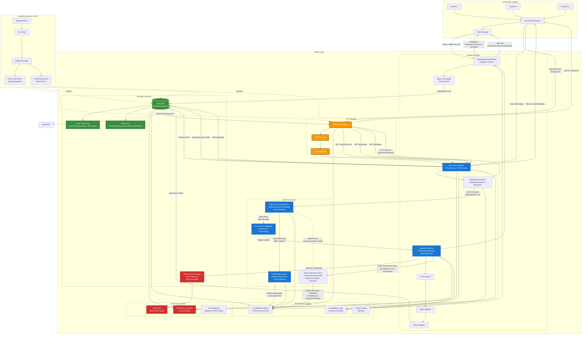

# Unifi Protect Event Backup API


[](https://dotnet.microsoft.com/)
[](https://aws.amazon.com/lambda/)
[](https://opensource.org/licenses/MIT)
[]()
[]()

An enterprise-grade AWS Lambda function that receives and processes webhook events from Unifi Dream Machine Protect systems, storing alarm event data in S3 for backup and analysis. The system includes automated video download capabilities using browser automation with comprehensive fault tolerance and retry mechanisms.

## 🚀 Quick Start

**New to this project?** Start with the [Quickstart Guide](docs/QUICKSTART.md) for complete setup instructions.

**Already familiar?** Here's the essentials:
1. **Fork & Configure**: Set up GitHub repository variables and secrets
2. **Deploy**: Push to main branch for automated deployment
3. **Configure Unifi**: Add webhook endpoint to your Unifi Protect system
4. **Monitor**: Check CloudWatch logs and S3 storage

## 📚 Table of Contents

- [Overview](#overview)
- [Features](#features)
- [Video Download Capabilities](#video-download-capabilities)
- [Architecture](#architecture)
- [API Endpoints](#api-endpoints)
- [Setup and Deployment](#setup-and-deployment)
- [Testing](#testing)
- [Security and Access Control](#security-and-access-control)
- [Monitoring and Logs](#monitoring-and-logs)
- [Data Structure](#data-structure)
- [Development](#development)
- [Troubleshooting](#troubleshooting)
- [Contributing](#contributing)

## 🎯 Recent Updates

- **Dead Letter Queue Integration**: Added comprehensive fault tolerance with automatic retry for "No video files were downloaded" errors
- **Enhanced Error Handling**: Failed video downloads now send original messages to DLQ for later retry with rich failure metadata
- **Improved Processing Reliability**: SQS DLQ integration provides automatic retry mechanisms for transient failures
- **Comprehensive Test Coverage Reporting**: Enhanced GitHub Actions workflow with detailed code coverage, branch coverage, and cyclomatic complexity analysis
- **Video Download Integration**: Automated video retrieval from Unifi Protect using HeadlessChromium browser automation optimized for AWS Lambda
- **Configurable UI Automation**: Environment variable-based coordinate configuration for browser automation click targets
- **Multi-Environment Support**: Separate development and production environments with automated deployment
- **Enhanced CI/CD Pipeline**: GitHub Actions workflow supporting branch-based deployments with quality gates
- **OpenAPI 3.0 Specification**: Complete API documentation with comprehensive endpoint coverage

## 📋 Overview

This serverless application provides a comprehensive backup and retrieval system for Unifi Protect alarm events and associated video content. When motion detection, intrusion alerts, or other configured events occur in your Unifi Protect system, webhooks are sent to this Lambda function which processes and stores both the event data and downloads the corresponding video files to Amazon S3.

### ⚡ Key Benefits
- **Zero Infrastructure Management**: Fully serverless AWS architecture
- **Fault Tolerant**: Dead Letter Queue with automatic retry mechanisms
- **High Availability**: Multi-environment support with automated CI/CD
- **Secure**: End-to-end encryption with IAM role-based access control
- **Cost Effective**: Pay-per-use serverless model with automatic lifecycle policies
- **Scalable**: Handles traffic spikes with SQS queuing and auto-scaling

## ✨ Features

### Core Functionality
- **Webhook Processing**: Receives real-time alarm events from Unifi Dream Machine
- **Asynchronous Processing**: SQS-based delayed processing for improved reliability
- **Dead Letter Queue**: Automatic retry mechanism for failed video downloads with rich failure metadata
- **Automated Video Download**: Browser automation for video retrieval using HeadlessChromium optimized for AWS Lambda
- **Data Storage**: Stores event data and videos in S3 with organized folder structure
- **Device Mapping**: Maps device MAC addresses to human-readable names via a single DeviceMetadata JSON configuration (set as a GitHub repository variable and passed to CloudFormation)
- **Configurable UI Automation**: Device-specific UI coordinates are now managed in DeviceMetadata JSON, not environment variables
- **Event Retrieval**: RESTful API for retrieving stored alarm events and video presigned URLs

### Technical Features
- **Multi-Environment Deployment**: Separate development and production environments
- **CORS Support**: Cross-origin resource sharing for web client integration
- **Comprehensive Error Handling**: Detailed logging and error management with DLQ retry mechanisms
- **Scalable Architecture**: Serverless design that scales automatically
- **Configurable UI Automation**: Environment variable-based coordinate configuration for browser interactions
- **Enterprise Test Coverage**: 78 unit tests with line, branch, and method coverage analysis plus complexity metrics

## 🎥 Video Download Capabilities

### 🔄 Automated Video Retrieval Process

The system includes asynchronous browser automation to download video content directly from Unifi Protect:

| Step | Process | Technology |
|------|---------|------------|
| 1 | **Webhook Receipt** | API Gateway receives alarm event and immediately returns success |
| 2 | **Event Queueing** | Lambda queues event for delayed processing (default: 2 minutes) |
| 3 | **Delayed Processing** | SQS triggers Lambda after delay to ensure video availability |
| 4 | **Browser Launch** | HeadlessChromium launches optimized for AWS Lambda environment |
| 5 | **Authentication** | Automated login to Unifi Protect using stored credentials |
| 6 | **Navigation** | Programmatic navigation to specific event pages using configurable coordinates |
| 7 | **Video Extraction** | Direct blob URL access and video content download |
| 8 | **Format Conversion** | Conversion to MP4 format for standardized storage |
| 9 | **S3 Storage** | Organized storage in S3 with date-based folder structure |

### 🎯 Benefits of Delayed Processing

- **Improved Success Rate**: 2-minute delay ensures videos are fully processed in Unifi Protect
- **Better Performance**: Immediate webhook response prevents timeouts and client retries
- **Enhanced Reliability**: Reduces failed downloads due to video availability timing
- **Scalable Processing**: SQS handles traffic spikes and provides automatic retries

### 🏗️ Technical Implementation

- **AWS Lambda Optimization**: Uses HeadlessChromium.Puppeteer.Lambda.Dotnet for Lambda-optimized browser automation
- **Configurable UI Interaction**: Click coordinates for archive button configurable via environment variables
- **Enhanced Download Configuration**: Chrome DevTools Protocol (CDP) integration for reliable download handling
- **Comprehensive Error Handling**: Detailed logging and retry mechanisms for browser automation
- **Performance Monitoring**: Three diagnostic screenshots captured at key stages (login, page load, archive click) for debugging

### 📁 Storage Organization

```
S3 Bucket Structure:
├── events/
│   └── YYYY-MM-DD/
│       ├── {eventId}_{deviceMac}_{timestamp}.json
│       └── {eventId}_{deviceMac}_{timestamp}.mp4
└── screenshots/
    └── YYYY-MM-DD/
        ├── {eventId}_{deviceMac}_{timestamp}_login-screenshot.png
        ├── {eventId}_{deviceMac}_{timestamp}_pageload-screenshot.png
        └── {eventId}_{deviceMac}_{timestamp}_afterarchivebuttonclick-screenshot.png
```

### ⏰ Data Retention Policy

The S3 storage bucket is configured with an automatic lifecycle policy that deletes all objects after **30 days**. This policy provides:

- ✅ **Automatic Cleanup**: Event data and video files are automatically removed after 30 days
- 💰 **Cost Management**: Prevents unlimited storage growth and associated costs
- 📋 **Compliance**: Maintains a consistent 30-day retention period for all alarm events
- 🔧 **Maintenance-Free**: No manual intervention required for data cleanup

The lifecycle rule applies to both JSON event files and MP4 video files, ensuring the bucket remains within reasonable storage limits while preserving recent events for analysis and review.

### 🚀 Recent Technical Improvements

#### AWS Lambda Optimization
- **HeadlessChromium Integration**: Replaced standard PuppeteerSharp BrowserFetcher with HeadlessChromium.Puppeteer.Lambda.Dotnet for improved AWS Lambda compatibility
- **Enhanced Download Handling**: Implemented Chrome DevTools Protocol (CDP) configuration for reliable download behavior in serverless environments
- **Memory and Performance Optimization**: Browser launch optimized for Lambda's execution environment

#### Configurable UI Automation
- **Environment Variable Configuration**: Browser automation coordinates now configurable via CloudFormation parameters
- **Flexible Deployment**: Different environments can use different UI coordinates without code changes
#### SQS Delayed Processing Architecture
- **Asynchronous Processing**: Webhook events are queued for delayed processing, ensuring videos are available before download attempts
- **Configurable Delay**: Processing delay configurable via CloudFormation (default: 2 minutes) to allow Unifi Protect video generation
- **Improved Reliability**: SQS integration with dead letter queue for failed processing and automatic retries
- **Enhanced Performance**: EventId-based file naming enables O(1) S3 prefix searches instead of JSON parsing loops

#### AWS Secrets Manager Integration
- **Secure Credential Storage**: Unifi Protect credentials stored securely in AWS Secrets Manager instead of environment variables
- **Automatic Credential Retrieval**: Lambda function automatically retrieves credentials at runtime with caching for performance
- **Encrypted at Rest**: Credentials are encrypted using AWS KMS and only accessible with proper IAM permissions
- **Credential Rotation Support**: Supports AWS Secrets Manager automatic credential rotation capabilities

## 🏛️ Architecture



### 🔑 Key Architectural Components

#### 🔄 **Dead Letter Queue (DLQ) Integration & Failure Email Notification**
- **Automatic Retry Mechanism**: Failed video downloads automatically send original alarm messages to a dedicated DLQ
- **Rich Failure Metadata**: DLQ messages include `FailureReason`, `OriginalTimestamp`, and `RetryAttempt` attributes
- **Failure Email Notification**: When a video download fails and a message is sent to the DLQ, the system automatically sends a failure notification email to the configured recipient(s). The email includes details about the failed event, the reason for failure, the DLQ message ID, and the retry attempt number.
- **Configuration**: Email recipients and sending method (e.g., AWS SES) are configured via environment variables or application settings. See the deployment documentation for setup details.
- **Exact Message Preservation**: Original alarm event preserved in DLQ for perfect retry scenarios
- **Specific Error Handling**: "No video files were downloaded" errors trigger DLQ processing and email notification
- **Manual Retry Support**: DLQ messages can be manually re-queued to main processing queue
- **Fault Tolerance**: Ensures no alarm events are lost due to temporary video availability issues

#### 📊 **SQS Delayed Processing Architecture**
- **Immediate Webhook Response**: API Gateway responds instantly (HTTP 200) after queuing the event
- **Configurable Delay**: Default 2-minute delay ensures video availability before processing
- **Message-Level Delay**: Each SQS message includes `DelaySeconds` for precise timing control
- **Auto-scaling**: Event Source Mapping automatically scales Lambda concurrency based on queue depth
- **Error Handling**: Dead Letter Queue captures failed messages after 3 retry attempts
- **Long Polling**: 20-second ReceiveMessageWaitTimeSeconds reduces API calls and improves efficiency

#### 🔐 **AWS Secrets Manager Integration**
- **Secure Credential Storage**: Unifi Protect credentials encrypted at rest using AWS KMS
- **Runtime Retrieval**: Lambda function retrieves credentials dynamically with caching for performance
- **Least Privilege Access**: IAM policies grant only `secretsmanager:GetSecretValue` permission
- **Credential Structure**: JSON format with `hostname`, `username`, and `password` fields
- **Rotation Ready**: Supports AWS Secrets Manager automatic credential rotation capabilities

#### 📁 **Enhanced File Organization**
- **EventId-Based Naming**: Files prefixed with `{eventId}_{deviceMac}_{timestamp}` for direct lookup
- **S3 Prefix Search**: O(1) event retrieval using S3 prefix matching instead of JSON parsing
- **Date-Based Folders**: Events organized in `YYYY-MM-DD/` folders for logical browsing
- **Dual Storage**: Event JSON and corresponding MP4 video files stored with matching keys

#### 🛡️ **Security & Compliance**
- **End-to-End Encryption**: S3 AES256 encryption, Secrets Manager KMS encryption
- **IAM Role-Based Access**: Least privilege permissions for Lambda execution
- **API Key Authentication**: API Gateway requires valid API key for all requests
- **CORS Support**: Configurable Cross-Origin Resource Sharing for web clients
- **Audit Trail**: All operations logged to CloudWatch with detailed execution context

### 🔄 Enhanced Data Flow

| Step | Process | Component |
|------|---------|-----------|
| 1 | **Event Detection** | Unifi cameras detect motion/intrusion events |
| 2 | **Webhook Trigger** | Unifi Dream Machine sends webhook to API Gateway |
| 3 | **Authentication** | API Gateway validates API key |
| 4 | **Event Queueing** | Lambda function validates JSON and queues event in SQS with delay |
| 5 | **Immediate Response** | API returns success immediately without blocking |
| 6 | **Delayed Processing** | After 2-minute delay, SQS triggers Lambda for processing |
| 7 | **Device Mapping** | Lambda maps device MAC addresses to human-readable names |
| 8 | **Event Storage** | Events stored in S3 with date-organized folder structure |
| 9 | **Video Download** | HeadlessChromium launches optimized browser for video retrieval |
| 10 | **Browser Automation** | Authenticates with Unifi Protect and navigates to event using configurable coordinates |
| 11 | **Video Extraction** | Extracts blob URL and downloads video content as MP4 |
| 12 | **Video Storage** | MP4 files stored in S3 under organized date-based folders |
| 13 | **Screenshot Capture** | Diagnostic screenshots captured at key automation stages for debugging |
| 14 | **Error Handling** | Failed video downloads trigger DLQ with original message and failure metadata |
| 15 | **Retry Capability** | DLQ messages can be manually re-queued for retry processing |
| 16 | **Monitoring** | All operations logged to CloudWatch for observability |
| 17 | **Retrieval** | GET endpoints allow querying events and generating video presigned URLs |

## 🗂️ File Structure

```
src/
├── Configuration/
│   └── AppConfiguration.cs              # Centralized configuration management
├── Infrastructure/
│   └── ServiceFactory.cs                # Dependency injection and service composition
├── Models/
│   └── UnifiCredentials.cs              # Data models for Unifi Protect credentials
├── Services/
│   ├── IAlarmProcessingService.cs        # Interface for alarm event processing
│   ├── ICredentialsService.cs           # Interface for credential management
│   ├── IRequestRouter.cs                # Interface for HTTP request routing
│   ├── IResponseHelper.cs               # Interface for HTTP response generation
│   ├── IS3StorageService.cs             # Interface for S3 storage operations
│   ├── ISqsService.cs                   # Interface for SQS message handling
│   ├── IUnifiProtectService.cs          # Interface for Unifi Protect interactions
│   └── Implementations/
│       ├── AlarmProcessingService.cs    # Core alarm event processing logic
│       ├── CredentialsService.cs        # AWS Secrets Manager integration
│       ├── RequestRouter.cs             # HTTP request routing and validation
│       ├── ResponseHelper.cs            # HTTP response formatting
│       ├── S3StorageService.cs          # Amazon S3 storage operations
│       ├── SqsService.cs                # Amazon SQS message processing
│       └── UnifiProtectService.cs       # Unifi Protect video download automation
├── AssemblyInfo.cs                      # Assembly metadata and attributes
├── Event.cs                             # Event data models and structures
├── UnifiWebhookEventHandler.cs          # Main Lambda entry point
```

### 🏗️ Service Architecture Benefits

- ✅ **Separation of Concerns**: Each service has a single, well-defined responsibility
- 🧪 **Testability**: Services can be unit tested independently with dependency injection
- 🔧 **Maintainability**: Clear boundaries make the codebase easier to understand and modify
- 📈 **Extensibility**: New features can be added as new services without affecting existing code
- 🎯 **SOLID Principles**: Implementation follows industry best practices for object-oriented design

### 🔄 Migration Path

The main Lambda handler is implemented in `UnifiWebhookEventHandler.cs`. Update your Lambda function handler configuration to use:

```
UnifiWebhookEventReceiver.UnifiWebhookEventHandler::FunctionHandler
```

## 🌐 API Endpoints

### 🌍 Custom Domain Support

The API Gateway can be configured with a custom domain name for more professional endpoints with automatic SSL certificate creation and DNS setup.

**Default URL Format:**
```
https://{api-id}.execute-api.{region}.amazonaws.com/{stage}/alarmevent
```

**Custom Domain Format:**
```
https://api.example.com/{stage}/alarmevent
```

#### ✅ Automatic Setup Features
- ✅ **SSL Certificate Creation**: Automatically creates and validates certificates (mandatory)
- ✅ **DNS Configuration**: Sets up Route53 A and AAAA records
- ✅ **Domain Validation**: Handles certificate validation via DNS  
- ✅ **Multi-Environment Support**: Different subdomains per environment
- ✅ **GitHub Actions Integration**: Environment variables for automated deployment

#### Configuration Requirements

**Required Parameters:**
-- `DomainName`: Your custom domain (e.g., `api.example.com`)
- `HostedZoneId`: Route53 Hosted Zone ID for your domain

**GitHub Repository Variables:**
- `HOSTED_ZONE_ID`: Route53 Hosted Zone ID
- `PROD_DOMAIN_NAME`: Production domain (e.g., `api.example.com`)
- `DEV_DOMAIN_NAME`: Development domain (e.g., `api-dev.example.com`)

See [DEPLOYMENT.md](docs/DEPLOYMENT.md) for detailed setup instructions.

### 🎯 Core Endpoints

#### 1. 📨 Webhook Receiver - `POST /{stage}/alarmevent`
Receives and queues alarm events from Unifi Protect systems for delayed processing
- **Purpose**: Validate webhook data and queue for processing after configurable delay
- **Authentication**: API Key required
- **Request**: JSON webhook payload from Unifi Dream Machine
- **Response**: Immediate success with queue information (eventId, processing delay, estimated completion time)
- **Processing**: Events queued in SQS with 2-minute delay for improved video download reliability

#### 2. 🔍 Event Retrieval - `GET /{stage}/?eventId={eventId}`
Retrieves stored alarm event data and video by event ID
- **Purpose**: Fetch specific alarm event JSON data and video download URL using the Unifi Protect event ID
- **Authentication**: API Key required
- **Parameters**: `eventId` - Event identifier (format: Unifi Protect event ID used as filename prefix: `{eventId}_{deviceMac}_{timestamp}.json`)
- **Response**: Complete alarm event JSON object with presigned video download URL
- **Optimization**: Uses eventId as filename prefix for direct file lookup without JSON parsing

#### 3. 📹 Latest Video Access - `GET /{stage}/latestvideo`
Provides presigned URL for downloading the most recent video file from all stored events
- **Purpose**: Get secure download URL for the latest MP4 video file
- **Authentication**: API Key required
- **Parameters**: None required
- **Response**: JSON with presigned S3 URL and metadata (URL expires in 1 hour)
- **File Naming**: Suggested filename `latest_video_{YYYY-MM-DD_HH-mm-ss}.mp4`
- **Optimization**: Efficiently searches from today's date folder backwards, day by day
- **Payload Limit Solution**: Uses presigned URLs to handle large video files (>6MB) that exceed API Gateway limits

#### 4. 📊 Camera Metadata - `GET /{stage}/metadata`
Fetches and stores current camera metadata from the Unifi Protect API
- **Purpose**: Retrieve camera configuration, names, and technical specifications from your Unifi Protect system
- **Authentication**: API Key required
- **Parameters**: None required
- **Response**: Complete camera metadata JSON with device information, names, MAC addresses, and configuration details
- **Storage**: Automatically stores fetched metadata as `metadata/cameras.json` in S3 for future reference
- **API Path**: Configurable via `UNIFI_API_METADATA_PATH` repository secret (defaults to `/proxy/protect/api/cameras`)
- **Use Cases**: Camera discovery, device mapping, configuration validation, system inventory

### 📖 OpenAPI 3.0 Specification


**Complete API Documentation:**
- [docs/openapi.yaml](docs/openapi.yaml) (OpenAPI 3.0 spec)
- [Swagger UI (OpenAPI) – GitHub Pages](https://engineerthefuture.github.io/unifi-protect-event-backup-api/api/index.html)

The full OpenAPI 3.0 specification is available in the [`docs/openapi.yaml`](docs/openapi.yaml) file and includes:

- 📝 **Complete endpoint documentation** with detailed request/response schemas
- 🎯 **Interactive examples** for all supported event types (motion, person, vehicle detection)
- ⚠️ **Comprehensive error handling** documentation with specific error codes
- 🔐 **Authentication and security** requirements
- ✅ **Validation patterns** for MAC addresses, timestamps, and event keys
- 🔧 **Client code generation support** for multiple programming languages

### 🛠️ Using the OpenAPI Specification

#### **1. View Interactive Documentation**
```bash
# Swagger UI
npx swagger-ui-serve docs/openapi.yaml

# Redoc
npx redoc-cli serve docs/openapi.yaml
```

#### **2. Generate Client SDKs**
```bash
# TypeScript/JavaScript client
npx @openapitools/openapi-generator-cli generate \
  -i docs/openapi.yaml \
  -g typescript-axios \
  -o ./generated-client

# Python client
openapi-generator-cli generate \
  -i docs/openapi.yaml \
  -g python \
  -o ./python-client
```

#### **3. API Testing**
- Import `docs/openapi.yaml` into **Postman**, **Insomnia**, or **Bruno**
- Use with **curl** for command-line testing
- Create mock servers with **Prism**: `npx @stoplight/prism mock docs/openapi.yaml`

#### **4. Validation**
```bash
# Validate specification
npx swagger-parser validate docs/openapi.yaml

# Lint for best practices
npx spectral lint docs/openapi.yaml
```

### 📋 Quick Reference

#### 📨 POST /alarmevent
Processes incoming alarm webhook events from Unifi Protect.

**Request Body**: JSON alarm event from Unifi Protect
**Response**: Success confirmation with event details

#### 🔍 GET /?eventId={id}
Downloads a video file by searching for the specified Unifi Protect event ID and returning a presigned URL.

**Parameters:**
- `eventId`: Unifi Protect event identifier (24-character hexadecimal string)

**Response**: JSON object containing:
- `downloadUrl`: Presigned S3 URL for direct video download (expires in 1 hour)
- `filename`: Suggested filename (`event_{eventId}_{YYYY-MM-DD_HH-mm-ss}.mp4`)
- `videoKey`: S3 object key for the video file
- `eventKey`: S3 object key for the corresponding event JSON data
- `eventId`: The searched Unifi Protect event identifier
- `timestamp`: Unix timestamp when the event occurred
- `eventDate`: Human-readable event date and time
- `expiresAt`: When the download URL expires
- `eventData`: Complete alarm event details including device name, trigger type, zones, and timestamps
- `message`: Instructions for using the download URL

**How it works:**
1. Searches through date-organized S3 folders (YYYY-MM-DD) for JSON event files
2. Parses each event file to find the matching eventId in trigger data
3. Locates the corresponding video file (.mp4)
4. Generates a secure, time-limited presigned URL for direct S3 download
5. Returns complete event context and metadata along with download URL

**Example Response for eventId**:
```json
{
  "downloadUrl": "https://s3.amazonaws.com/bucket/2025-01-17/28704E113F33_1739819436108.mp4?X-Amz-Signature=...",
  "filename": "event_67b389ab005ec703e40075a5_2025-01-17_20-43-56.mp4",
  "videoKey": "2025-01-17/28704E113F33_1739819436108.mp4",
  "eventKey": "2025-01-17/28704E113F33_1739819436108.json",
  "eventId": "67b389ab005ec703e40075a5",
  "timestamp": 1739819436108,
  "eventDate": "2025-01-17 20:43:56",
  "expiresAt": "2025-01-17 21:43:56 UTC",
  "eventData": {
    "name": "Motion Detection Alert",
    "timestamp": 1739819436108,
    "triggers": [
      {
        "key": "motion",
        "device": "28704E113F33",
        "eventId": "67b389ab005ec703e40075a5",
        "deviceName": "Backyard West"
      }
    ]
  },
  "message": "Use the downloadUrl to download the video file directly. URL expires in 1 hour."
}
```

#### 📹 GET /latestvideo
Returns a presigned URL for downloading the most recent video file from all stored events.

**Parameters**: None required

**Response**: JSON object containing:
- `downloadUrl`: Presigned S3 URL for direct video download (expires in 1 hour)
- `filename`: Suggested filename (`latest_video_{YYYY-MM-DD_HH-mm-ss}.mp4`)
- `videoKey`: S3 object key for the video file
- `eventKey`: S3 object key for the corresponding event JSON data
- `timestamp`: Unix timestamp when the event occurred
- `eventDate`: Human-readable event date and time
- `expiresAt`: When the download URL expires
- `eventData`: Complete alarm event details including device name, trigger type, zones, and timestamps
- `message`: Instructions for using the download URL

**Why Presigned URL?**: Video files typically exceed API Gateway's 6MB payload limit, so this endpoint returns a secure, time-limited URL for direct S3 download instead of the video data itself.

**Example Response**:
```json
{
  "downloadUrl": "https://s3.amazonaws.com/bucket/2024-01-15/video_1705316234.mp4?X-Amz-Signature=...",
  "filename": "latest_video_2024-01-15_10-30-34.mp4",
  "videoKey": "2024-01-15/video_1705316234.mp4",
  "eventKey": "2024-01-15/event_1705316234.json",
  "timestamp": 1705316234,
  "eventDate": "2024-01-15 10:30:34 UTC",
  "expiresAt": "2024-01-15 11:30:34 UTC",
  "eventData": {
    "deviceName": "Front Door Camera",
    "triggers": ["MOTION", "PERSON"],
    "zones": ["Driveway", "Walkway"],
    "score": 95,
    "recordingStartTime": 1705316234
  },
  "message": "Use the downloadUrl to download the video file directly"
}
```

#### 📊 GET /metadata
Fetches current camera metadata from your Unifi Protect system and stores it in S3.

**Parameters**: None required

**Response**: JSON object containing:
- `message`: Success confirmation message
- `metadata`: Complete camera metadata object with device information

**What it does**:
1. Connects to your Unifi Protect API using stored credentials
2. Fetches complete camera metadata including device names, MAC addresses, and configuration
3. Stores the metadata as `metadata/cameras.json` in your S3 bucket for future reference
4. Returns the fetched metadata in the API response

**Configuration**: The API endpoint path is configurable via the `UNIFI_API_METADATA_PATH` repository secret, which defaults to `/proxy/protect/api/cameras` if not specified.

**Example Response**:
```json
{
  "message": "Camera metadata fetched and stored successfully.",
  "metadata": {
    "cameras": [
      {
        "id": "67b389ab005ec703e40075a5",
        "name": "Front Door Camera",
        "mac": "28:70:4E:11:3F:64",
        "type": "UVC-G4-Doorbell",
        "state": "CONNECTED",
        "isRecording": true,
        "channels": [
          {
            "id": 0,
            "width": 1600,
            "height": 1200,
            "fps": 15
          }
        ]
      }
    ]
  }
}
```

### 📋 Device Metadata Configuration

Device and UI coordinate mapping is now managed via a single JSON environment variable, `DeviceMetadata`, set as a GitHub repository variable and passed to CloudFormation. Example:

```
{"Devices":[{"DeviceName":"Backyard East","DeviceMac":"28704EAA3F64","ArchiveButtonX":1205,"ArchiveButtonY":240},{"DeviceName":"Front","DeviceMac":"F4E2C6BB2FE8","ArchiveButtonX":1205,"ArchiveButtonY":240},{"DeviceName":"Side","DeviceMac":"28704EC13C44","ArchiveButtonX":1205,"ArchiveButtonY":240},{"DeviceName":"Backyard West","DeviceMac":"28704ED13F33","ArchiveButtonX":1205,"ArchiveButtonY":240},{"DeviceName":"Door","DeviceMac":"F4E2AB77E20F","ArchiveButtonX":1275,"ArchiveButtonY":260}]}
```

- Set this as the `DEVICE_METADATA` GitHub repository variable.
- The Lambda function will use this for all device name and coordinate lookups.

### ⚙️ Environment Variables (Manual Deploy)

If deploying manually, configure these environment variables in your Lambda function:

| Variable | Description | Example |
|----------|-------------|---------|
| `StorageBucket` | S3 bucket name for storing events | `my-unifi-events-bucket` |
| `DeployedEnv` | Environment identifier | `prod` |
| `FunctionName` | Lambda function name | `UnifiProtectEventReceiver` |
| `UnifiHost` | Unifi Protect hostname or IP address | `192.168.1.1` |
| `UnifiUsername` | Unifi Protect username | `admin` |
| `UnifiPassword` | Unifi Protect password | `password123` |
| `UnifiApiMetadataPath` | API path for camera metadata | `/proxy/protect/api/cameras` |
| `DownloadDirectory` | Download directory path | `/tmp` |
| `DeviceMetadata` | JSON string for device mapping and coordinates | See above |

> **Note:** `ArchiveButtonX`, `ArchiveButtonY`, `DevicePrefix`, and `DeviceMac*` environment variables are no longer used. All device mapping and UI coordinates are now managed via the `DeviceMetadata` JSON.

## 🤖 Automated Deployment (Recommended)

### 🔄 Multi-Environment GitHub Actions Workflow

The project includes a comprehensive CI/CD pipeline that automatically builds, tests, and deploys to the appropriate environment based on the branch:

- **Production Deployment**: Push to `main` branch → Production environment
- **Development Deployment**: Push to any other branch → Development environment

#### ✨ Workflow Features

- 🎯 **Environment Detection**: Automatically determines target environment based on branch name
- 🧪 **Comprehensive Quality Gate**: Runs 76 unit tests with detailed coverage analysis (line, branch, method coverage + cyclomatic complexity)
- 🏗️ **Multi-Stage Pipeline**: Separate build and deploy jobs for better error isolation  
- 📊 **Test Reporting**: Automated generation of interactive HTML coverage reports and quality assessments
- 📦 **Artifact Management**: Preserves build outputs, test results, and coverage reports
- ☁️ **AWS Integration**: Uses OIDC for secure AWS authentication
- 🏗️ **Infrastructure as Code**: Complete CloudFormation-based infrastructure management

#### 📝 Required GitHub Repository Variables

Configure these variables in your GitHub repository settings (Settings → Secrets and variables → Actions → Variables):

| Variable | Description | Example |
|----------|-------------|---------|
| `AWS_ACCOUNT_ID` | Your AWS account ID | `123456789012` |
| `OIDC_ROLE_NAME` | IAM role for GitHub OIDC | `GitHubActionsRole` |
| `OWNER_NAME` | Resource owner name | `Brent Foster` |
| `APP_NAME` | Application name | `unifi-protect-event-backup-api` |
| `APP_DESCRIPTION` | Application description | `Unifi webhook alarm event processing and backup API` |

#### 🔐 Required GitHub Repository Secrets

Configure these secrets in your GitHub repository settings (Settings → Secrets and variables → Actions → Secrets):

| Secret | Description | Required For |
|--------|-------------|--------------|
| `PROD_UNIFI_HOST` | Unifi Protect hostname or IP address for production | Production deployments |
| `DEV_UNIFI_HOST` | Unifi Protect hostname or IP address for development | Development deployments |
| `UNIFI_HOST_IP` | Unifi Protect IP address for DNS record | All deployments |
| `UNIFI_USERNAME` | Unifi Protect username | Video download functionality |
| `UNIFI_PASSWORD` | Unifi Protect password | Video download functionality |
| `UNIFI_API_KEY` | Unifi Protect API key for metadata access | All deployments |
| `UNIFI_API_METADATA_PATH` | Custom API path for camera metadata | Metadata endpoint customization (optional, defaults to `/proxy/protect/api/cameras`) |

#### 🔑 OIDC IAM Role Setup

Create an IAM role in AWS with the following trust policy for GitHub Actions:

```json
{
  "Version": "2012-10-17",
  "Statement": [
    {
      "Effect": "Allow",
      "Principal": {
        "Federated": "arn:aws:iam::YOUR_ACCOUNT_ID:oidc-provider/token.actions.githubusercontent.com"
      },
      "Action": "sts:AssumeRole",
      "Condition": {
        "StringEquals": {
          "token.actions.githubusercontent.com:sub": "repo:YOUR_USERNAME/unifi-protect-event-backup-api:ref:refs/heads/main",
          "token.actions.githubusercontent.com:aud": "sts.amazonaws.com"
        },
        "StringLike": {
          "token.actions.githubusercontent.com:sub": "repo:engineerthefuture/*"
        }
      }
    }
  ]
}
```

Attach these policies to the role:
- ✅ `CloudFormationFullAccess`
- ✅ `IAMFullAccess`
- ✅ `AmazonS3FullAccess`
- ✅ `AWSLambdaFullAccess`
- ✅ `AmazonAPIGatewayInvokeFullAccess`

#### 🚀 Workflow Execution

1. **Trigger**: Push code to the `main` branch
2. **Build Stage**:
   - Checkout code
   - Setup .NET 8.0
   - Restore dependencies (main + test projects)
   - Build projects in Release configuration
   - **Run unit tests** ⚠️ **DEPLOYMENT GATE**
   - Generate test reports and artifacts (with fallback for permission issues)
   - Package Lambda function
   - Upload to S3 deployment bucket
3. **Deploy Stage** (only if build succeeds):
   - Deploy CloudFormation stack
   - Update Lambda function code

#### 📊 Test Result Integration

- ✅ Test results are displayed in GitHub's Actions UI (when permissions allow)
- ❌ Failed tests prevent deployment automatically
- 📦 Test artifacts are preserved for download
- 🎯 Clear status indicators show test pass/fail state
- 🔄 Fallback test summary displayed in workflow logs if reporter fails

**Note**: The workflow includes enhanced permissions (`checks: write`, `pull-requests: write`) and fallback mechanisms to handle potential test reporter permission issues.

**Quality Assurance**: The codebase has been updated to eliminate all nullable reference type warnings while maintaining proper error handling and test compatibility.

## ☁️ CloudFormation Infrastructure

### 🏗️ Infrastructure Components

The CloudFormation template (`templates/cf-stack-cs.yaml`) creates a complete serverless infrastructure:

#### 🔧 Core Resources

1. **Lambda Function**
   - Runtime: .NET 8.0
   - Memory: 128 MB
   - Timeout: 30 seconds
   - Environment variables for configuration

2. **API Gateway**
   - RESTful API with proxy integration
   - CORS support for web clients
   - API key authentication
   - Request/response logging
   - Rate limiting and throttling

3. **S3 Bucket**
   - Encrypted storage for alarm events
   - Public access blocked for security
   - Organized folder structure by date

4. **IAM Roles**
   - Lambda execution role with minimal required permissions
   - API Gateway CloudWatch logging role

#### 📊 Template Parameters

| Parameter | Default | Description |
|-----------|---------|-------------|
| `AppName` | `unifi-protect-event-backup-api` | Application name |
| `EnvPrefix` | `prod` | Environment prefix |
| `BucketName` | `bf-prod-s3-unifi-protect-event-backup-api` | S3 bucket for events |
| `BucketNameDeployment` | `bf-prod-s3-deployments` | S3 bucket for deployments |
| `FunctionName` | `bf-prod-lambda-unifi-protect-event-backup-api` | Lambda function name |
| `OwnerName` | `Brent Foster` | Resource owner |
| `AppDescription` | `Unifi webhook alarm event processing and backup API` | Description |

#### 📛 Resource Naming Convention

Resources follow a consistent naming pattern: `{GlobalPrefix}-{EnvPrefix}-{ResourceType}-{AppName}`

Example:
- Lambda: `bf-prod-lambda-unifi-protect-event-backup-api`
- S3 Bucket: `bf-prod-s3-unifi-protect-event-backup-api`
- API Gateway: `bf-prod-lambda-unifi-protect-event-backup-api-API`

#### ⚙️ Environment Variables (Auto-configured)

The CloudFormation template automatically configures these Lambda environment variables:

| Variable | Source | Purpose |
|----------|--------|---------|
| `FunctionName` | CloudFormation parameter | Lambda function identification |
| `DeployedEnv` | CloudFormation parameter | Environment identifier |
| `StorageBucket` | S3 bucket name | Event storage location |
| `ApiKey` | Generated API key | API Gateway authentication |
| `AlarmProcessingQueueUrl` | SQS queue URL | Delayed alarm processing queue |
| `AlarmProcessingDlqUrl` | SQS DLQ URL | Dead letter queue for failed video downloads |
| `DeviceMac{MacAddress}` | Template values | Device name mappings |
| `UnifiHost` | CloudFormation parameter | Unifi Protect hostname |
| `UnifiUsername` | CloudFormation parameter | Unifi Protect username |
| `UnifiPassword` | CloudFormation parameter | Unifi Protect password |
| `UnifiApiMetadataPath` | CloudFormation parameter | Custom API path for camera metadata (default: `/proxy/protect/api/cameras`) |
| `DownloadDirectory` | CloudFormation parameter | Download directory (default: `/tmp`) |
| `ArchiveButtonX` | CloudFormation parameter | X coordinate for archive button (default: 1274) |
| `ArchiveButtonY` | CloudFormation parameter | Y coordinate for archive button (default: 257) |

## 🧪 Testing

### 🔬 Unit Testing

The project includes a comprehensive test suite with **76 unit tests** covering all functionality including SQS integration, Secrets Manager, file organization, and error handling scenarios.

```bash
# Run unit tests only
dotnet test test/ --verbosity normal

# Generate detailed coverage report with multiple formats
dotnet test test/ --collect:"XPlat Code Coverage" --settings test/coverlet.runsettings
```

### 📊 Code Coverage & Quality Metrics

The project maintains high code quality standards with comprehensive coverage analysis:

#### 📈 **Coverage Types**
- **Line Coverage**: Tracks percentage of executable code lines covered by tests
- **Branch Coverage**: Measures coverage of conditional branches (if/else, switch statements)
- **Method Coverage**: Ensures all methods have corresponding test coverage
- **Cyclomatic Complexity**: Analyzes method complexity for maintainability assessment

#### 📋 **Automated Reporting**
The GitHub Actions workflow automatically generates:
- 📊 **Interactive HTML Reports**: Drill-down coverage analysis with file and method details
- 📈 **Coverage Badges**: Visual status indicators for coverage percentages
- 📋 **Summary Reports**: Console-friendly coverage overviews in workflow logs
- 🔍 **Quality Assessment**: Automated interpretation of coverage quality and recommendations

#### 🎯 **Coverage Thresholds**
- 🟢 **Excellent**: ≥80% coverage across all metrics
- 🟡 **Good**: 60-79% coverage (recommended improvement areas identified)
- 🔴 **Needs Improvement**: <60% coverage (requires immediate attention)

#### 🔄 **Workflow Integration**
- **Quality Gates**: Tests must pass before deployment proceeds
- **PR Comments**: Coverage summaries automatically added to pull requests  
- **Artifact Downloads**: Full HTML coverage reports available from workflow runs
- **Trend Analysis**: Coverage metrics tracked across builds for continuous improvement

### 💻 Local Coverage Analysis

For detailed local development analysis:

```bash
# Install global coverage tools
dotnet tool install --global dotnet-reportgenerator-globaltool

# Run tests with detailed coverage collection
dotnet test test/ \
  --collect:"XPlat Code Coverage" \
  --settings test/coverlet.runsettings \
  /p:CollectCoverage=true \
  /p:CoverletOutputFormat=opencover

# Generate comprehensive HTML report
reportgenerator \
  -reports:"test/TestResults/*/coverage.opencover.xml" \
  -targetdir:"coverage-html" \
  -reporttypes:"Html;JsonSummary;Badges"

# Open interactive report
open coverage-html/index.html
```

### 🌐 API Testing Examples

#### 📨 Test Webhook Endpoint
```bash
curl -X POST "https://your-api-gateway-url/prod/alarmevent" \
  -H "Content-Type: application/json" \
  -H "x-api-key: your-api-key" \
  -d '{
    "eventLocalLink": "https://192.168.0.1/protect/events/event/123",
    "triggers": [{
      "device": "F4E2C67A2FE8",
      "key": "motion",
      "eventId": "test-event-123"
    }],
    "timestamp": 1755383421797
  }'
```

## 🔧 Manual Deployment (Alternative)

### ⚙️ Environment Variables

If deploying manually, configure these environment variables in your Lambda function:

| Variable | Description | Example |
|----------|-------------|---------|
| `StorageBucket` | S3 bucket name for storing events | `my-unifi-events-bucket` |
| `DeployedEnv` | Environment identifier | `prod` |
| `FunctionName` | Lambda function name | `UnifiProtectEventReceiver` |
| `UnifiHost` | Unifi Protect hostname or IP address | `192.168.1.1` |
| `UnifiUsername` | Unifi Protect username | `admin` |
| `UnifiPassword` | Unifi Protect password | `password123` |
| `UnifiApiMetadataPath` | API path for camera metadata | `/proxy/protect/api/cameras` |
| `DownloadDirectory` | Download directory path | `/tmp` |
| `DeviceMetadata` | JSON string for device mapping and coordinates | See above |

> **Note:** `ArchiveButtonX`, `ArchiveButtonY`, `DevicePrefix`, and `DeviceMac*` environment variables are no longer used. All device mapping and UI coordinates are now managed via the `DeviceMetadata` JSON.

### 📱 Device Name Mapping

Map device MAC addresses to human-readable names using environment variables:

```
DeviceMacAA:BB:CC:DD:EE:FF = "Front Door Camera"
DeviceMac11:22:33:44:55:66 = "Backyard Camera"
```

### 🔨 Manual Build and Deploy

1. **Build the project**:
   ```bash
   dotnet build --configuration Release
   ```

2. **Run tests**:
   ```bash
   dotnet test test/ --configuration Release
   ```

3. **Deploy CloudFormation stack**:
   ```bash
   aws cloudformation deploy \
     --template-file templates/cf-stack-cs.yaml \
     --stack-name unifi-protect-event-backup-api \
     --capabilities CAPABILITY_IAM CAPABILITY_NAMED_IAM \
     --parameter-overrides \
       OwnerName="Your Name" \
       AppName="unifi-protect-event-backup-api" \
       AppDescription="Unifi webhook alarm event processing"
   ```

4. **Deploy Lambda function**:
   ```bash
   dotnet lambda deploy-function
   ```

## 🚀 Post-Deployment Configuration

### 📋 Retrieving Deployment Information

After successful deployment, you'll need to configure Unifi Protect with the API endpoint and key.

#### 🌐 Get API Gateway Endpoint

From CloudFormation outputs:
```bash
aws cloudformation describe-stacks \
  --stack-name bf-prod-unifi-protect-event-backup-api \
  --query 'Stacks[0].Outputs[?OutputKey==`POSTUnfiWebhookAlarmEventEndpoint`].OutputValue' \
  --output text
```

#### 🔑 Get API Key

```bash
aws apigateway get-api-keys \
  --query 'items[?name==`bf-prod-lambda-unifi-protect-event-backup-api-ApiKey`].value' \
  --include-values \
  --output text
```

### 🎯 Unifi Protect Configuration

#### 👤 User Account Setup
1. **Create Camera Viewing Role** (if not exists):
   - Navigate to Settings → Users & Authentication → Roles
   - Create or verify a role with "Protect Camera Viewing Only" permissions
2. **Create Dedicated User Account**:
   - Navigate to Settings → Users & Authentication → Users
   - Create a new user and assign to the Camera Viewing Only role
   - Enable "Restrict to Local Access" and configure local credentials
   - Use these credentials as your `UNIFI_USERNAME` and `UNIFI_PASSWORD`

#### 🔗 Webhook Configuration
1. **Open Unifi Protect web interface**
2. **Navigate to Settings → Integrations → Webhooks**
3. **Add a new webhook**:
   - **URL**: Use the API Gateway endpoint from CloudFormation outputs
   - **API Key**: Add as `X-API-Key` header
   - **Events**: Configure motion detection, intrusion, person detection, etc.
4. **Test the webhook** to ensure connectivity

Example webhook URL format:
```
https://abcd1234.execute-api.us-east-1.amazonaws.com/prod/alarmevent
```

### 🧪 Testing the Deployment

#### 🔧 Test with curl

```bash
# Test OPTIONS (CORS preflight)
curl -X OPTIONS \
  -H "X-API-Key: YOUR_API_KEY" \
  https://your-api-gateway-url/prod/alarmevent

# Test with sample alarm event
curl -X POST \
  -H "Content-Type: application/json" \
  -H "X-API-Key: YOUR_API_KEY" \
  -d '{"alarm":{"name":"Test Alarm","triggers":[{"key":"motion","device":"AA:BB:CC:DD:EE:FF","eventId":"test123"}]},"timestamp":1640995200000}' \
  https://your-api-gateway-url/prod/alarmevent
```

#### ☁️ Verify S3 Storage

Check that events are being stored:
```bash
aws s3 ls s3://bf-prod-s3-unifi-protect-event-backup-api/ --recursive
```

## 📊 Deployment Monitoring and Maintenance

### 👀 GitHub Actions Monitoring

- **Action Status**: Monitor workflow runs in the Actions tab
- **Test Reports**: Review test results and coverage
- **Deployment Logs**: Check CloudFormation deployment progress
- **Artifacts**: Download build outputs and test results

### ☁️ AWS Resource Monitoring

#### 📝 CloudWatch Logs

```bash
# Lambda function logs
aws logs describe-log-groups --log-group-name-prefix "/aws/lambda/bf-prod-lambda-unifi-protect-event-backup-api"

# API Gateway logs
aws logs describe-log-groups --log-group-name-prefix "API-Gateway-Execution-Logs"
```

#### 📊 CloudWatch Metrics

Monitor these key metrics:
- **Lambda Duration**: Function execution time
- **Lambda Errors**: Error count and rate
- **API Gateway 4XXError**: Client error rate
- **API Gateway 5XXError**: Server error rate
- **API Gateway Count**: Request volume

#### 🗄️ S3 Storage Monitoring

```bash
# Check bucket size and object count
aws cloudwatch get-metric-statistics \
  --namespace AWS/S3 \
  --metric-name BucketSizeBytes \
  --dimensions Name=BucketName,Value=bf-prod-s3-unifi-protect-event-backup-api \
  --start-time 2024-01-01T00:00:00Z \
  --end-time 2024-12-31T23:59:59Z \
  --period 86400 \
  --statistics Average
```

### 🔄 Deployment Updates

#### 🤖 Automated Updates
- Push code changes to the `main` branch
- GitHub Actions automatically builds, tests, and deploys
- Monitor the Actions tab for deployment status

#### 🔧 Manual Updates
```bash
# Update CloudFormation stack with parameter changes
aws cloudformation update-stack \
  --stack-name bf-prod-unifi-protect-event-backup-api \
  --template-body file://templates/cf-stack-cs.yaml \
  --parameters ParameterKey=DeviceMacNEWDEVICE,ParameterValue="New Camera Name" \
  --capabilities CAPABILITY_IAM CAPABILITY_NAMED_IAM
```

### 🔍 Troubleshooting Deployments

#### ⚠️ Common Issues

1. **GitHub Actions OIDC Authentication Fails**
   - Verify IAM role trust policy
   - Check repository variables are correctly set
   - Ensure OIDC provider is configured in AWS

2. **CloudFormation Stack Rollback**
   - Check CloudFormation events in AWS console
   - Verify IAM permissions for stack operations
   - Check parameter validation and resource limits

3. **Lambda Function Update Fails**
   - Verify S3 bucket permissions
   - Check Lambda function exists and is accessible
   - Verify deployment package is valid

4. **API Gateway Issues**
   - Test API key authentication
   - Check CORS configuration
   - Verify Lambda integration permissions

#### 🐛 Debugging Commands

```bash
# Check GitHub Actions workflow status
gh run list --repo your-username/unifi-protect-event-backup-api

# View CloudFormation stack details
aws cloudformation describe-stacks \
  --stack-name bf-prod-unifi-protect-event-backup-api

# Check Lambda function configuration
aws lambda get-function-configuration \
  --function-name bf-prod-lambda-unifi-protect-event-backup-api

# View recent Lambda logs
aws logs tail /aws/lambda/bf-prod-lambda-unifi-protect-event-backup-api \
  --follow

# Test API Gateway endpoint
curl -X POST \
  -H "Content-Type: application/json" \
  -H "X-API-Key: YOUR_API_KEY" \
  -d '{"test": "data"}' \
  https://your-api-id.execute-api.us-east-1.amazonaws.com/prod/alarmevent

# Check S3 bucket contents
aws s3 ls s3://bf-prod-s3-unifi-protect-event-backup-api/ --recursive

# Monitor API Gateway metrics
aws cloudwatch get-metric-statistics \
  --namespace AWS/ApiGateway \
  --metric-name Count \
  --dimensions Name=ApiName,Value=bf-prod-lambda-unifi-protect-event-backup-api-API \
  --start-time 2024-01-01T00:00:00Z \
  --end-time 2024-01-02T00:00:00Z \
  --period 3600 \
  --statistics Sum

# Check Dead Letter Queue messages
aws sqs get-queue-attributes \
  --queue-url https://sqs.us-east-1.amazonaws.com/123456789012/AlarmProcessingDeadLetterQueue \
  --attribute-names All

# Receive messages from DLQ (for inspection)
aws sqs receive-message \
  --queue-url https://sqs.us-east-1.amazonaws.com/123456789012/AlarmProcessingDeadLetterQueue \
  --max-number-of-messages 10 \
  --message-attribute-names All

# Re-queue DLQ message to main processing queue (manual retry)
aws sqs send-message \
  --queue-url https://sqs.us-east-1.amazonaws.com/123456789012/AlarmProcessingQueue \
  --message-body '{"original":"alarm","data":"here"}' \
  --delay-seconds 0
```

### 📚 Support Resources

- 📖 **AWS Documentation**: [Lambda](https://docs.aws.amazon.com/lambda/), [API Gateway](https://docs.aws.amazon.com/apigateway/), [CloudFormation](https://docs.aws.amazon.com/cloudformation/)
- 🔧 **GitHub Actions**: [Documentation](https://docs.github.com/en/actions)
- 🏠 **Unifi Protect**: [API Documentation](https://uisp.ui.com/unifi-protect)

### 🆘 Getting Help

1. 📝 **Check CloudWatch Logs** first for detailed error messages
2. 🔍 **Review GitHub Actions logs** for deployment issues
3. 🧪 **Test components individually** to isolate problems
4. ⚙️ **Use AWS CLI commands** to verify resource configuration
5. 🐛 **Create GitHub Issues** for bugs or feature requests

## 🤝 Contributing

1. 🍴 Fork the repository
2. 🌿 Create a feature branch (`git checkout -b feature/amazing-feature`)
3. ✨ Make your changes
4. 🧪 Add tests for new functionality
5. 📤 Submit a pull request

## 📚 Documentation

- 🚀 **[Quickstart Guide](docs/QUICKSTART.md)** - Step-by-step setup for new AWS accounts
- 📖 **[API Documentation](docs/openapi.yaml)** - Complete OpenAPI 3.0 specification
- 🚀 **[Deployment Guide](docs/DEPLOYMENT.md)** - Multi-environment deployment instructions

## 📄 License

This project is licensed under the MIT License - see the [LICENSE](LICENSE) file for details.

## 👨‍💻 Author

**Brent Foster** - [GitHub Profile](https://github.com/engineerthefuture)

---

<div align="center">

**🎯 Built with ❤️ for the Unifi Protect community**

[](https://github.com/engineerthefuture/unifi-protect-event-backup-api)
[](https://github.com/engineerthefuture/unifi-protect-event-backup-api)

</div>

**Brent Foster**  
Created: December 23, 2024  
Updated: August 24, 2025

---

### Support

For questions, issues, or contributions:
- **Issues**: [GitHub Issues](https://github.com/engineerthefuture/unifi-protect-event-backup-api/issues)
- **Feature Requests**: Use GitHub Issues with the `enhancement` label
- **Documentation**: Check the `docs/` directory for detailed guides

