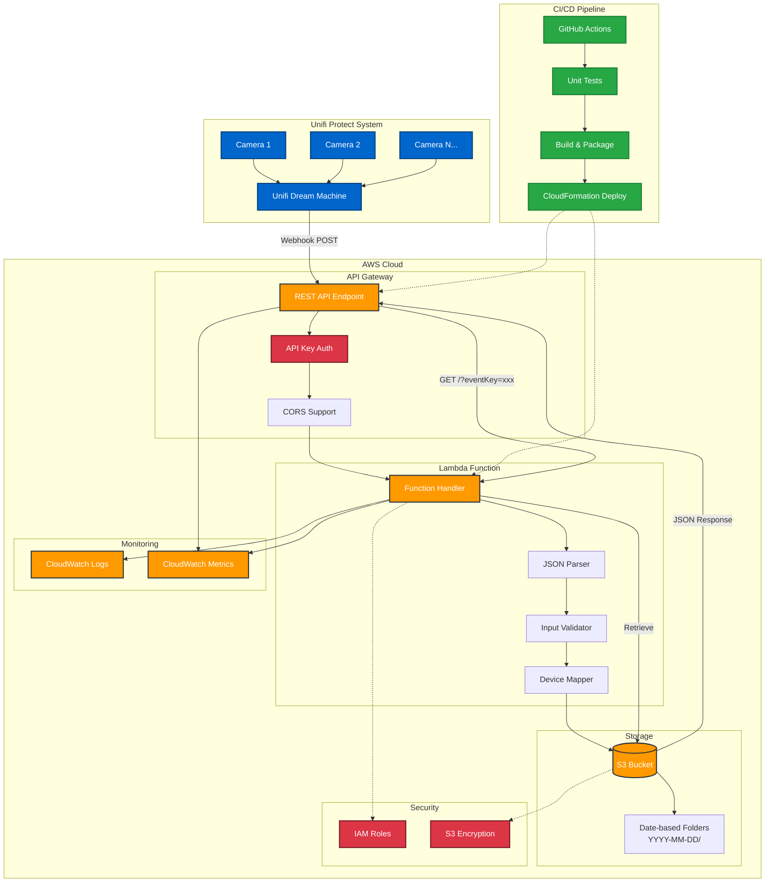

# Unifi Protect Event Backup API

An AWS Lambda function that receives and processes webhook events from Unifi Dream Machine Protect systems, storing alarm event data in S3 for backup and analysis.

## Overview

This serverless application provides a reliable backup and retrieval system for Unifi Protect alarm events. When motion detection, intrusion alerts, or other configured events occur in your Unifi Protect system, webhooks are sent to this Lambda function which processes and stores the event data in Amazon S3 with an organized date-based folder structure.

## Features

- **Webhook Processing**: Receives real-time alarm events from Unifi Dream Machine
- **Data Storage**: Stores event data in S3 with date-organized folder structure (`YYYY-MM-DD/`)
- **Device Mapping**: Maps device MAC addresses to human-readable names via environment variables
- **Event Retrieval**: RESTful API for retrieving stored alarm events
- **CORS Support**: Cross-origin resource sharing for web client integration
- **Error Handling**: Comprehensive error handling and logging
- **Scalable**: Serverless architecture that scales automatically with load

## Architecture



### Data Flow

1. **Event Detection**: Unifi cameras detect motion/intrusion events
2. **Webhook Trigger**: Unifi Dream Machine sends webhook to API Gateway
3. **Authentication**: API Gateway validates API key
4. **Processing**: Lambda function parses JSON, maps device names, validates data
5. **Storage**: Events stored in S3 with date-organized folder structure
6. **Monitoring**: All operations logged to CloudWatch for observability
7. **Retrieval**: GET endpoint allows querying stored events by event key

## API Endpoints

### OpenAPI 3.0 Specification

```yaml
openapi: 3.0.3
info:
  title: Unifi Protect Event Backup API
  description: |
    AWS Lambda function that receives and processes webhook events from Unifi Dream Machine Protect systems, 
    storing alarm event data in S3 for backup and analysis.
    
    ## Features
    - Real-time webhook processing from Unifi Protect systems
    - Secure S3 storage with date-organized folder structure
    - Device MAC address to human-readable name mapping
    - RESTful event retrieval API
    - Comprehensive CORS support for web clients
  version: 1.0.0
  contact:
    name: Brent Foster
    email: brent@engineerthefuture.com
  license:
    name: MIT
    url: https://opensource.org/licenses/MIT

servers:
  - url: https://your-api-id.execute-api.us-east-1.amazonaws.com/prod
    description: Production AWS API Gateway endpoint

security:
  - ApiKeyAuth: []

paths:
  /alarmevent:
    post:
      summary: Process Unifi Protect alarm webhook
      description: |
        Receives and processes webhook events from Unifi Dream Machine Protect systems.
        Events are validated, enriched with device names, and stored in S3 with organized folder structure.
      operationId: processAlarmEvent
      tags:
        - Alarm Events
      requestBody:
        required: true
        content:
          application/json:
            schema:
              $ref: '#/components/schemas/UnifiWebhookRequest'
            examples:
              motionDetection:
                summary: Motion Detection Event
                value:
                  alarm:
                    name: "Backup Alarm Event"
                    sources:
                      - device: "28704E113F64"
                        type: "include"
                    conditions:
                      - condition:
                          type: "is"
                          source: "motion"
                    triggers:
                      - key: "motion"
                        device: "28704E113F33"
                        eventId: "67b389ab005ec703e40075a5"
                        zones:
                          zone: []
                          line: []
                          loiter: []
                  timestamp: 1739819436108
      responses:
        '200':
          description: Event successfully processed and stored
          content:
            application/json:
              schema:
                $ref: '#/components/schemas/SuccessResponse'
              example:
                message: "bf-prod-lambda-unifi-protect-event-backup-api has successfully processed the Unifi alarm event webhook with key 28704E113F33_1739819436108.json for Backyard West that occurred at 2025-01-17T20:43:56."
        '400':
          description: Bad request - Invalid or malformed data
          content:
            application/json:
              schema:
                $ref: '#/components/schemas/ErrorResponse'
              examples:
                invalidJson:
                  summary: Invalid JSON format
                  value:
                    msg: "ERROR 400: malformed or invalid request format"
                missingAlarm:
                  summary: Missing alarm object
                  value:
                    msg: "ERROR 400: No alarm object found in request"
                noTriggers:
                  summary: Missing triggers
                  value:
                    msg: "ERROR 400: you must have triggers in your payload"
        '401':
          description: Unauthorized - Invalid or missing API key
          content:
            application/json:
              schema:
                $ref: '#/components/schemas/ErrorResponse'
              example:
                message: "Unauthorized"
        '500':
          description: Internal server error
          content:
            application/json:
              schema:
                $ref: '#/components/schemas/ErrorResponse'
              example:
                msg: "Server configuration error: StorageBucket not configured"
    
    options:
      summary: CORS preflight request
      description: Handles CORS preflight requests for web client support
      operationId: handleCorsOptions
      tags:
        - CORS
      responses:
        '200':
          description: CORS headers provided
          headers:
            Access-Control-Allow-Origin:
              schema:
                type: string
                example: "*"
            Access-Control-Allow-Methods:
              schema:
                type: string
                example: "OPTIONS,POST,GET"
            Access-Control-Allow-Headers:
              schema:
                type: string
                example: "Content-Type,X-API-Key"

  /:
    get:
      summary: Retrieve stored alarm event
      description: |
        Retrieves a previously stored alarm event by its unique event key.
        Event keys follow the format: {deviceMac}_{timestamp}.json
      operationId: getAlarmEvent
      tags:
        - Event Retrieval
      parameters:
        - name: eventKey
          in: query
          required: true
          schema:
            type: string
            pattern: '^[A-Fa-f0-9]{12}_\d+\.json$'
            example: "28704E113F33_1739819436108.json"
          description: |
            Unique event identifier in format: {deviceMac}_{timestamp}.json
            - deviceMac: 12-character hexadecimal MAC address (no colons)
            - timestamp: Unix timestamp in milliseconds
            - .json: File extension
      responses:
        '200':
          description: Event successfully retrieved
          content:
            application/json:
              schema:
                $ref: '#/components/schemas/StoredAlarmEvent'
              example:
                name: "Motion Detection Alert"
                timestamp: 1739819436108
                triggers:
                  - key: "motion"
                    device: "28704E113F33"
                    eventId: "67b389ab005ec703e40075a5"
                    deviceName: "Backyard West"
                    date: "2025-01-17T20:43:56"
                    eventKey: "28704E113F33_1739819436108.json"
                sources:
                  - device: "28704E113F64"
                    type: "include"
                conditions:
                  - condition:
                      type: "is"
                      source: "motion"
                eventPath: "/protect/events/67b389ab005ec703e40075a5"
                eventLocalLink: "https://udm.local/protect/events/67b389ab005ec703e40075a5"
        '400':
          description: Bad request - Missing or invalid event key
          content:
            application/json:
              schema:
                $ref: '#/components/schemas/ErrorResponse'
              example:
                msg: "ERROR 400: you must provide an eventKey in the path"
        '404':
          description: Event not found
          content:
            application/json:
              schema:
                $ref: '#/components/schemas/ErrorResponse'
              example:
                msg: "Event not found"
        '500':
          description: Internal server error
          content:
            application/json:
              schema:
                $ref: '#/components/schemas/ErrorResponse'

components:
  securitySchemes:
    ApiKeyAuth:
      type: apiKey
      in: header
      name: X-API-Key
      description: |
        API key required for all requests. Obtain from AWS API Gateway console
        or CloudFormation stack outputs after deployment.

  schemas:
    UnifiWebhookRequest:
      type: object
      required:
        - alarm
        - timestamp
      properties:
        alarm:
          $ref: '#/components/schemas/AlarmObject'
        timestamp:
          type: integer
          format: int64
          description: Unix timestamp in milliseconds when the event occurred
          example: 1739819436108
      description: Webhook request payload from Unifi Protect system

    AlarmObject:
      type: object
      required:
        - name
        - triggers
      properties:
        name:
          type: string
          description: Human-readable name of the alarm configuration
          example: "Backup Alarm Event"
        sources:
          type: array
          items:
            $ref: '#/components/schemas/AlarmSource'
          description: List of devices included/excluded in the alarm
        conditions:
          type: array
          items:
            $ref: '#/components/schemas/AlarmCondition'
          description: Conditions that must be met to trigger the alarm
        triggers:
          type: array
          minItems: 1
          items:
            $ref: '#/components/schemas/AlarmTrigger'
          description: List of trigger events that activated this alarm
        eventPath:
          type: string
          description: Internal path to the event in Unifi Protect
          example: "/protect/events/67b389ab005ec703e40075a5"
        eventLocalLink:
          type: string
          format: uri
          description: Local URL to view the event in Unifi Protect interface
          example: "https://udm.local/protect/events/67b389ab005ec703e40075a5"

    AlarmSource:
      type: object
      required:
        - device
        - type
      properties:
        device:
          type: string
          pattern: '^[A-Fa-f0-9]{12}$'
          description: Device MAC address (12 hex characters, no separators)
          example: "28704E113F64"
        type:
          type: string
          enum: ["include", "exclude"]
          description: Whether this device is included or excluded from the alarm
          example: "include"

    AlarmCondition:
      type: object
      required:
        - condition
      properties:
        condition:
          type: object
          required:
            - type
            - source
          properties:
            type:
              type: string
              enum: ["is", "is_not"]
              description: Type of condition check
              example: "is"
            source:
              type: string
              enum: ["motion", "person", "vehicle", "package", "intrusion"]
              description: Type of detection that triggers the condition
              example: "motion"

    AlarmTrigger:
      type: object
      required:
        - key
        - device
        - eventId
      properties:
        key:
          type: string
          enum: ["motion", "person", "vehicle", "package", "intrusion"]
          description: Type of detection that triggered the alarm
          example: "motion"
        device:
          type: string
          pattern: '^[A-Fa-f0-9]{12}$'
          description: MAC address of the device that detected the event
          example: "28704E113F33"
        eventId:
          type: string
          description: Unique identifier for this specific detection event
          example: "67b389ab005ec703e40075a5"
        zones:
          type: object
          properties:
            zone:
              type: array
              items:
                type: string
              description: Detection zones that were triggered
            line:
              type: array
              items:
                type: string
              description: Line crossing zones that were triggered
            loiter:
              type: array
              items:
                type: string
              description: Loitering zones that were triggered
          description: Specific zones within the camera's field of view that triggered
        deviceName:
          type: string
          description: Human-readable device name (added during processing)
          example: "Backyard West"
        date:
          type: string
          format: date-time
          description: ISO 8601 formatted timestamp (added during processing)
          example: "2025-01-17T20:43:56"
        eventKey:
          type: string
          description: Unique key for retrieving this event (added during processing)
          example: "28704E113F33_1739819436108.json"

    StoredAlarmEvent:
      allOf:
        - $ref: '#/components/schemas/AlarmObject'
        - type: object
          properties:
            timestamp:
              type: integer
              format: int64
              description: Unix timestamp in milliseconds when the event occurred
              example: 1739819436108
      description: Alarm event as stored in S3 with additional processing metadata

    SuccessResponse:
      type: object
      required:
        - message
      properties:
        message:
          type: string
          description: Success message with event processing details
          example: "bf-prod-lambda-unifi-protect-event-backup-api has successfully processed the Unifi alarm event webhook with key 28704E113F33_1739819436108.json for Backyard West that occurred at 2025-01-17T20:43:56."

    ErrorResponse:
      type: object
      required:
        - msg
      properties:
        msg:
          type: string
          description: Error message describing what went wrong
          example: "ERROR 400: malformed or invalid request format"

tags:
  - name: Alarm Events
    description: Processing of incoming alarm webhook events
  - name: Event Retrieval
    description: Retrieval of stored alarm events
  - name: CORS
    description: Cross-Origin Resource Sharing support

externalDocs:
  description: Full API Documentation
  url: https://github.com/engineerthefuture/unifi-protect-event-backup-api/blob/main/README.md
```

### Quick Reference

#### POST /alarmevent
Processes incoming alarm webhook events from Unifi Protect.

**Request Body**: JSON alarm event from Unifi Protect
**Response**: Success confirmation with event details

#### GET /?eventKey={key}
Retrieves a stored alarm event by its unique key.

**Parameters**: 
- `eventKey`: Unique event identifier (format: `{deviceMac}_{timestamp}.json`)

**Response**: JSON alarm event data

#### OPTIONS /alarmevent
Handles CORS preflight requests for web client support.

## Setup and Deployment

This project supports multiple deployment methods, with the recommended approach being automated deployment via GitHub Actions.

### Prerequisites

- .NET 8.0 SDK
- AWS CLI configured with appropriate permissions
- AWS Lambda Tools for .NET (for manual deployment)
- GitHub repository with Actions enabled (for automated deployment)

## Automated Deployment (Recommended)

### GitHub Actions Workflow

The project includes a comprehensive CI/CD pipeline that automatically builds, tests, and deploys your application when code is pushed to the main branch.

#### Workflow Features

- **Quality Gate**: Automatically runs unit tests and blocks deployment if any tests fail
- **Multi-Stage Pipeline**: Separate build and deploy jobs for better error isolation
- **Artifact Management**: Preserves build outputs and test results
- **AWS Integration**: Uses OIDC for secure AWS authentication
- **CloudFormation**: Manages complete AWS infrastructure as code

#### Required GitHub Repository Variables

Configure these variables in your GitHub repository settings (Settings → Secrets and variables → Actions → Variables):

| Variable | Description | Example |
|----------|-------------|---------|
| `AWS_ACCOUNT_ID` | Your AWS account ID | `123456789012` |
| `OIDC_ROLE_NAME` | IAM role for GitHub OIDC | `GitHubActionsRole` |
| `OWNER_NAME` | Resource owner name | `Brent Foster` |
| `APP_NAME` | Application name | `unifi-protect-event-backup-api` |
| `APP_DESCRIPTION` | Application description | `Unifi webhook alarm event processing and backup API` |

#### OIDC IAM Role Setup

Create an IAM role in AWS with the following trust policy for GitHub Actions:

```json
{
  "Version": "2012-10-17",
  "Statement": [
    {
      "Effect": "Allow",
      "Principal": {
        "Federated": "arn:aws:iam::YOUR_ACCOUNT_ID:oidc-provider/token.actions.githubusercontent.com"
      },
      "Action": "sts:AssumeRole",
      "Condition": {
        "StringEquals": {
          "token.actions.githubusercontent.com:sub": "repo:YOUR_USERNAME/unifi-protect-event-backup-api:ref:refs/heads/main",
          "token.actions.githubusercontent.com:aud": "sts.amazonaws.com"
        },
        "StringLike": {
          "token.actions.githubusercontent.com:sub": "repo:engineerthefuture/*"
        }
      }
    }
  ]
}
```

Attach these policies to the role:
- `CloudFormationFullAccess`
- `IAMFullAccess`
- `AmazonS3FullAccess`
- `AWSLambdaFullAccess`
- `AmazonAPIGatewayInvokeFullAccess`

#### Workflow Execution

1. **Trigger**: Push code to the `main` branch
2. **Build Stage**:
   - Checkout code
   - Setup .NET 8.0
   - Restore dependencies (main + test projects)
   - Build projects in Release configuration
   - **Run unit tests** ⚠️ **DEPLOYMENT GATE**
   - Generate test reports and artifacts (with fallback for permission issues)
   - Package Lambda function
   - Upload to S3 deployment bucket
3. **Deploy Stage** (only if build succeeds):
   - Deploy CloudFormation stack
   - Update Lambda function code

#### Test Result Integration

- Test results are displayed in GitHub's Actions UI (when permissions allow)
- Failed tests prevent deployment automatically
- Test artifacts are preserved for download
- Clear status indicators show test pass/fail state
- Fallback test summary displayed in workflow logs if reporter fails

**Note**: The workflow includes enhanced permissions (`checks: write`, `pull-requests: write`) and fallback mechanisms to handle potential test reporter permission issues.

**Quality Assurance**: The codebase has been updated to eliminate all nullable reference type warnings while maintaining proper error handling and test compatibility.

## CloudFormation Infrastructure

### Infrastructure Components

The CloudFormation template (`templates/cf-stack-cs.yaml`) creates a complete serverless infrastructure:

#### Core Resources

1. **Lambda Function**
   - Runtime: .NET 8.0
   - Memory: 128 MB
   - Timeout: 30 seconds
   - Environment variables for configuration

2. **API Gateway**
   - RESTful API with proxy integration
   - CORS support for web clients
   - API key authentication
   - Request/response logging
   - Rate limiting and throttling

3. **S3 Bucket**
   - Encrypted storage for alarm events
   - Public access blocked for security
   - Organized folder structure by date

4. **IAM Roles**
   - Lambda execution role with minimal required permissions
   - API Gateway CloudWatch logging role

#### Template Parameters

| Parameter | Default | Description |
|-----------|---------|-------------|
| `AppName` | `unifi-protect-event-backup-api` | Application name |
| `EnvPrefix` | `prod` | Environment prefix |
| `BucketName` | `bf-prod-s3-unifi-protect-event-backup-api` | S3 bucket for events |
| `BucketNameDeployment` | `bf-prod-s3-deployments` | S3 bucket for deployments |
| `FunctionName` | `bf-prod-lambda-unifi-protect-event-backup-api` | Lambda function name |
| `OwnerName` | `Brent Foster` | Resource owner |
| `AppDescription` | `Unifi webhook alarm event processing and backup API` | Description |

#### Resource Naming Convention

Resources follow a consistent naming pattern: `{EnvPrefix}-{ResourceType}-{AppName}`

Example:
- Lambda: `bf-prod-lambda-unifi-protect-event-backup-api`
- S3 Bucket: `bf-prod-s3-unifi-protect-event-backup-api`
- API Gateway: `bf-prod-lambda-unifi-protect-event-backup-api-API`

#### Environment Variables (Auto-configured)

The CloudFormation template automatically configures these Lambda environment variables:

| Variable | Source | Purpose |
|----------|--------|---------|
| `FunctionName` | CloudFormation parameter | Lambda function identification |
| `DeployedEnv` | CloudFormation parameter | Environment identifier |
| `StorageBucket` | S3 bucket name | Event storage location |
| `ApiKey` | Generated API key | API Gateway authentication |
| `DevicePrefix` | Fixed value: `DeviceMac` | Device mapping prefix |
| `DeviceMac{MacAddress}` | Template values | Device name mappings |

#### Pre-configured Device Mappings

The template includes example device mappings:

```yaml
DeviceMac28704E113F64: "Backyard East"
DeviceMacF4E2C67A2FE8: "Front"
DeviceMac28704E113C44: "Side"
DeviceMac28704E113F33: "Backyard West"
DeviceMacF4E2C677E20F: "Door"
```

Update these in the CloudFormation template to match your Unifi device MAC addresses.

## Manual Deployment (Alternative)

### Environment Variables

If deploying manually, configure these environment variables in your Lambda function:

| Variable | Description | Example |
|----------|-------------|---------|
| `StorageBucket` | S3 bucket name for storing events | `my-unifi-events-bucket` |
| `DevicePrefix` | Prefix for device name mapping variables | `DeviceMac` |
| `DeployedEnv` | Environment identifier | `prod` |
| `FunctionName` | Lambda function name | `UnifiProtectEventReceiver` |

### Device Name Mapping

Map device MAC addresses to human-readable names using environment variables:

```
DeviceMacAA:BB:CC:DD:EE:FF = "Front Door Camera"
DeviceMac11:22:33:44:55:66 = "Backyard Camera"
```

### Manual Build and Deploy

1. **Build the project**:
   ```bash
   dotnet build --configuration Release
   ```

2. **Run tests**:
   ```bash
   dotnet test test/ --configuration Release
   ```

3. **Deploy CloudFormation stack**:
   ```bash
   aws cloudformation deploy \
     --template-file templates/cf-stack-cs.yaml \
     --stack-name unifi-protect-event-backup-api \
     --capabilities CAPABILITY_IAM CAPABILITY_NAMED_IAM \
     --parameter-overrides \
       OwnerName="Your Name" \
       AppName="unifi-protect-event-backup-api" \
       AppDescription="Unifi webhook event processing"
   ```

4. **Deploy Lambda function**:
   ```bash
   dotnet lambda deploy-function
   ```

## Post-Deployment Configuration

### Retrieving Deployment Information

After successful deployment, you'll need to configure Unifi Protect with the API endpoint and key.

#### Get API Gateway Endpoint

From CloudFormation outputs:
```bash
aws cloudformation describe-stacks \
  --stack-name bf-prod-unifi-protect-event-backup-api \
  --query 'Stacks[0].Outputs[?OutputKey==`POSTUnfiWebhookAlarmEventEndpoint`].OutputValue' \
  --output text
```

#### Get API Key

```bash
aws apigateway get-api-keys \
  --query 'items[?name==`bf-prod-lambda-unifi-protect-event-backup-api-ApiKey`].value' \
  --include-values \
  --output text
```

### Unifi Protect Configuration

1. **Open Unifi Protect web interface**
2. **Navigate to Settings → Integrations → Webhooks**
3. **Add a new webhook**:
   - **URL**: Use the API Gateway endpoint from CloudFormation outputs
   - **API Key**: Add as `X-API-Key` header
   - **Events**: Configure motion detection, intrusion, person detection, etc.
4. **Test the webhook** to ensure connectivity

Example webhook URL format:
```
https://abcd1234.execute-api.us-east-1.amazonaws.com/prod/alarmevent
```

### Testing the Deployment

#### Test with curl

```bash
# Test OPTIONS (CORS preflight)
curl -X OPTIONS \
  -H "X-API-Key: YOUR_API_KEY" \
  https://your-api-gateway-url/prod/alarmevent

# Test with sample alarm event
curl -X POST \
  -H "Content-Type: application/json" \
  -H "X-API-Key: YOUR_API_KEY" \
  -d '{"alarm":{"name":"Test Alarm","triggers":[{"key":"motion","device":"AA:BB:CC:DD:EE:FF","eventId":"test123"}]},"timestamp":1640995200000}' \
  https://your-api-gateway-url/prod/alarmevent
```

#### Verify S3 Storage

Check that events are being stored:
```bash
aws s3 ls s3://bf-prod-s3-unifi-protect-event-backup-api/ --recursive
```

## Deployment Monitoring and Maintenance

### GitHub Actions Monitoring

- **Action Status**: Monitor workflow runs in the Actions tab
- **Test Reports**: Review test results and coverage
- **Deployment Logs**: Check CloudFormation deployment progress
- **Artifacts**: Download build outputs and test results

### AWS Resource Monitoring

#### CloudWatch Logs

```bash
# Lambda function logs
aws logs describe-log-groups --log-group-name-prefix "/aws/lambda/bf-prod-lambda-unifi-protect-event-backup-api"

# API Gateway logs
aws logs describe-log-groups --log-group-name-prefix "API-Gateway-Execution-Logs"
```

#### CloudWatch Metrics

Monitor these key metrics:
- **Lambda Duration**: Function execution time
- **Lambda Errors**: Error count and rate
- **API Gateway 4XXError**: Client error rate
- **API Gateway 5XXError**: Server error rate
- **API Gateway Count**: Request volume

#### S3 Storage Monitoring

```bash
# Check bucket size and object count
aws cloudwatch get-metric-statistics \
  --namespace AWS/S3 \
  --metric-name BucketSizeBytes \
  --dimensions Name=BucketName,Value=bf-prod-s3-unifi-protect-event-backup-api \
  --start-time 2024-01-01T00:00:00Z \
  --end-time 2024-12-31T23:59:59Z \
  --period 86400 \
  --statistics Average
```

### Deployment Updates

#### Automated Updates
- Push code changes to the `main` branch
- GitHub Actions automatically builds, tests, and deploys
- Monitor the Actions tab for deployment status

#### Manual Updates
```bash
# Update CloudFormation stack with parameter changes
aws cloudformation update-stack \
  --stack-name bf-prod-unifi-protect-event-backup-api \
  --template-body file://templates/cf-stack-cs.yaml \
  --parameters ParameterKey=DeviceMacNEWDEVICE,ParameterValue="New Camera Name" \
  --capabilities CAPABILITY_IAM CAPABILITY_NAMED_IAM
```

### Troubleshooting Deployments

#### Common Issues

1. **GitHub Actions OIDC Authentication Fails**
   - Verify IAM role trust policy
   - Check repository variables are correctly set
   - Ensure OIDC provider is configured in AWS

2. **CloudFormation Stack Rollback**
   - Check CloudFormation events in AWS console
   - Verify IAM permissions for stack operations
   - Check parameter validation and resource limits

3. **Lambda Function Update Fails**
   - Verify S3 bucket permissions
   - Check Lambda function exists and is accessible
   - Verify deployment package is valid

4. **API Gateway Issues**
   - Test API key authentication
   - Check CORS configuration
   - Verify Lambda integration permissions

#### Debugging Commands

```bash
# Check CloudFormation stack status
aws cloudformation describe-stacks --stack-name bf-prod-unifi-protect-event-backup-api

# View CloudFormation events
aws cloudformation describe-stack-events --stack-name bf-prod-unifi-protect-event-backup-api

# Test Lambda function directly
aws lambda invoke \
  --function-name bf-prod-lambda-unifi-protect-event-backup-api \
  --payload '{"body":"{\"alarm\":{\"triggers\":[{\"key\":\"test\",\"device\":\"test\",\"eventId\":\"test\"}]}}"}' \
  response.json

# Check API Gateway deployment
aws apigateway get-deployments --rest-api-id YOUR_API_ID
```

## Data Structure

### Incoming Webhook Format

Unifi Protect sends webhook requests with the following structure:

```json
{
    "alarm": {
        "name": "Backup Alarm Event",
        "sources": [
            { "device": "28704E113F64", "type": "include" },
            { "device": "F4E2C67A2FE8", "type": "include" }
        ],
        "conditions": [
            { "condition": { "type": "is", "source": "motion" } },
            { "condition": { "type": "is", "source": "person" } }
        ],
        "triggers": [
            {
                "key": "motion",
                "device": "28704E113F33",
                "eventId": "67b389ab005ec703e40075a5",
                "zones": { "zone": [], "line": [], "loiter": [] }
            }
        ]
    },
    "timestamp": 1739819436108
}
```

### Stored Event Format

Events are processed and stored in S3 as JSON files with additional metadata:

```json
{
  "name": "Motion Detection Alert",
  "timestamp": 1704067200000,
  "triggers": [
    {
      "key": "motion",
      "device": "AA:BB:CC:DD:EE:FF",
      "eventId": "12345",
      "deviceName": "Front Door Camera",
      "date": "2024-01-01T00:00:00",
      "eventKey": "AA:BB:CC:DD:EE:FF_1704067200000.json"
    }
  ],
  "sources": [...],
  "conditions": [...],
  "eventPath": "/path/to/event",
  "eventLocalLink": "https://udm.local/protect/events/..."
}
```

### S3 Storage Organization

```
my-unifi-events-bucket/
├── 2024-01-01/
│   ├── AA:BB:CC:DD:EE:FF_1704067200000.json
│   └── 11:22:33:44:55:66_1704070800000.json
├── 2024-01-02/
│   └── AA:BB:CC:DD:EE:FF_1704153600000.json
└── ...
```

## Development

### Project Structure

```
├── src/
│   ├── UnifiWebhookEventReceiver.cs    # Main Lambda handler
│   └── Alarm.cs                        # Data models
├── test/
│   ├── UnifiWebhookEventReceiverTests.cs   # Unit tests
│   └── UnifiWebhookEventReceiverTests.csproj
├── templates/
│   └── cf-stack-cs.yaml               # CloudFormation template
├── UnifiWebhookEventReceiver.csproj   # Main project file
└── UnifiWebhookEventReceiver.sln      # Solution file
```

### Key Technologies Used

- **AWS Lambda with API Gateway**: Handles HTTP requests and webhook payloads
- **[JSON Deserialization](https://www.newtonsoft.com/json/help/html/DeserializeObject.htm)**: Uses `Newtonsoft.Json` to parse incoming JSON payloads
- **[Environment Variables](https://learn.microsoft.com/en-us/dotnet/api/system.environment.getenvironmentvariable)**: Retrieves AWS configuration settings dynamically
- **[S3 File Uploading](https://docs.aws.amazon.com/AmazonS3/latest/userguide/upload-objects.html)**: Stores alarm event data as JSON files in an S3 bucket
- **[Asynchronous Task Execution](https://learn.microsoft.com/en-us/dotnet/csharp/programming-guide/concepts/async/)**: Improves performance by handling I/O-bound operations efficiently

### Dependencies

- **[Newtonsoft.Json](https://www.newtonsoft.com/json)** – JSON framework for .NET used for parsing request bodies
- **[Amazon.Lambda.Core](https://www.nuget.org/packages/Amazon.Lambda.Core/)** – Provides logging and runtime context for AWS Lambda functions
- **[Amazon.S3 SDK](https://www.nuget.org/packages/AWSSDK.S3/)** – Interfaces with Amazon S3 for object storage
- **[Amazon.Lambda.APIGatewayEvents](https://www.nuget.org/packages/Amazon.Lambda.APIGatewayEvents/)** – API Gateway integration types

### Running Tests

```bash
# Run all tests
dotnet test

# Run with coverage
dotnet test --collect:"XPlat Code Coverage"
```

### Local Development

The function can be tested locally using the AWS Lambda Test Tool:

```bash
dotnet lambda-test-tool-3.1
```

## Security and Access Control

### Infrastructure Security

The CloudFormation template implements security best practices:

#### S3 Bucket Security
- **Server-side encryption** with AES-256
- **Public access blocked** at bucket level
- **IAM-based access control** for Lambda function only
- **Bucket policy** prevents unauthorized access

#### API Gateway Security
- **API Key authentication** required for all endpoints
- **Rate limiting** and throttling to prevent abuse
- **Request/response logging** for audit trails
- **CORS configuration** for controlled cross-origin access

#### Lambda Function Security
- **Minimal IAM permissions** following principle of least privilege
- **VPC isolation** (can be configured if needed)
- **Environment variable encryption** at rest
- **Function-level logging** and monitoring

#### IAM Role Permissions

The Lambda execution role includes only necessary permissions:

```json
{
  "Version": "2012-10-17",
  "Statement": [
    {
      "Effect": "Allow",
      "Action": [
        "s3:GetObject",
        "s3:PutObject",
        "s3:ListBucket"
      ],
      "Resource": [
        "arn:aws:s3:::your-bucket-name",
        "arn:aws:s3:::your-bucket-name/*"
      ]
    },
    {
      "Effect": "Allow",
      "Action": [
        "logs:CreateLogGroup",
        "logs:CreateLogStream",
        "logs:PutLogEvents"
      ],
      "Resource": "arn:aws:logs:*:*:*"
    }
  ]
}
```

#### GitHub Actions Security

- **OIDC authentication** eliminates long-lived AWS credentials
- **Temporary tokens** with limited scope and duration
- **Branch-based access control** restricts deployments to main branch
- **Repository secrets** protect sensitive configuration

### Access Control Best Practices

1. **API Key Management**
   - Rotate API keys regularly
   - Monitor API key usage in CloudWatch
   - Use different keys for different environments

2. **Network Security**
   - Consider VPC deployment for enhanced isolation
   - Use WAF for additional API protection
   - Monitor unusual traffic patterns

3. **Data Security**
   - Event data is encrypted at rest in S3
   - Implement retention policies for compliance
   - Consider additional encryption for sensitive data

4. **Monitoring and Alerting**
   - Set up CloudWatch alarms for error rates
   - Monitor failed authentication attempts
   - Alert on unusual API usage patterns

### Compliance Considerations

- **Data retention**: Configure S3 lifecycle policies
- **Audit logging**: CloudTrail integration for API calls
- **Access logging**: All requests logged to CloudWatch
- **Change tracking**: CloudFormation tracks infrastructure changes

## Monitoring and Logs

### CloudWatch Integration

- **Function Logs**: All Lambda execution logs automatically sent to CloudWatch
- **API Gateway Logs**: Request/response logging with configurable detail level
- **Custom Metrics**: Application-specific metrics for monitoring
- **Error Tracking**: Failed requests and exceptions logged with detailed error messages

### Monitoring Dashboard

Key metrics to monitor:

1. **Lambda Metrics**:
   - Duration, Error count, Throttles
   - Concurrent executions, Dead letter queue errors

2. **API Gateway Metrics**:
   - Request count, Error rates (4XX/5XX)
   - Integration latency, Client errors

3. **S3 Metrics**:
   - Object count, Bucket size
   - Request metrics, Error rates

### Alerting Setup

Example CloudWatch alarms:

```bash
# High error rate alarm
aws cloudwatch put-metric-alarm \
  --alarm-name "Lambda-HighErrorRate" \
  --alarm-description "Lambda function error rate > 5%" \
  --metric-name Errors \
  --namespace AWS/Lambda \
  --statistic Sum \
  --period 300 \
  --threshold 5 \
  --comparison-operator GreaterThanThreshold

# API Gateway 5XX errors
aws cloudwatch put-metric-alarm \
  --alarm-name "API-Gateway-ServerErrors" \
  --alarm-description "API Gateway 5XX error rate > 1%" \
  --metric-name 5XXError \
  --namespace AWS/ApiGateway \
  --statistic Sum \
  --period 300 \
  --threshold 1 \
  --comparison-operator GreaterThanThreshold
```

## Troubleshooting

### Deployment Issues

#### GitHub Actions Failures

1. **Unit Tests Failing**
   - Check test output in Actions tab
   - Run tests locally: `dotnet test test/`
   - Fix failing tests before pushing to main branch

2. **OIDC Authentication Errors**
   ```
   Error: Could not assume role with OIDC
   ```
   - Verify IAM role exists and has correct trust policy
   - Check repository variables are set correctly
   - Ensure OIDC provider is configured in your AWS account

3. **CloudFormation Deployment Failures**
   ```
   Error: Stack CREATE_FAILED
   ```
   - Check CloudFormation events in AWS Console
   - Verify IAM permissions for stack operations
   - Check for resource naming conflicts
   - Validate template parameter constraints

4. **Lambda Update Failures**
   ```
   Error: The role defined for the function cannot be assumed by Lambda
   ```
   - Verify IAM role trust policy includes `lambda.amazonaws.com`
   - Check role permissions include Lambda execution permissions

4. **Test Reporter Permission Issues**
   ```
   Error: HttpError: Resource not accessible by integration
   ```
   **Causes and Solutions:**
   - **Missing Permissions**: Ensure workflow has `checks: write` and `pull-requests: write` permissions
   - **Repository Settings**: Verify Actions can create check runs in repository settings
   - **Branch Protection**: Check that branch protection rules don't block check creation
   - **Token Scope**: The default `GITHUB_TOKEN` may have insufficient permissions
   
   **Workarounds:**
   - The workflow includes `continue-on-error: true` for the test reporter step
   - Test results are still uploaded as artifacts
   - Test summary is displayed in workflow logs
   - Tests still block deployment on failure regardless of reporter issues

#### Runtime Issues

1. **Lambda Function Errors**
   ```
   ERROR: Request failed with status code 500
   ```
   - Check CloudWatch Logs for detailed error messages
   - Verify environment variables are correctly set
   - Test function with sample payloads

2. **S3 Access Denied**
   ```
   ERROR: Access Denied when writing to S3
   ```
   - Verify Lambda execution role has S3 permissions
   - Check bucket name matches environment variable
   - Ensure bucket exists and is in the correct region

3. **API Gateway Issues**
   ```
   ERROR: Missing Authentication Token
   ```
   - Verify API key is included in request headers
   - Check API key is active and associated with usage plan
   - Validate request URL and method

4. **Device Mapping Issues**
   ```
   WARNING: Device name not found for MAC address
   ```
   - Check environment variables for device mappings
   - Verify MAC address format matches expected pattern
   - Update CloudFormation template with correct device mappings

### Operational Issues

1. **High Error Rates**
   - Check CloudWatch metrics for Lambda errors
   - Review API Gateway logs for failed requests
   - Monitor S3 operation failures

2. **Performance Issues**
   - Check Lambda duration metrics
   - Monitor API Gateway latency
   - Review S3 request patterns

3. **Storage Issues**
   - Monitor S3 bucket size and object count
   - Check for failed S3 uploads
   - Verify date-based folder structure

### Debugging Commands

```bash
# Check GitHub Actions workflow status
gh run list --repo your-username/unifi-protect-event-backup-api

# View CloudFormation stack details
aws cloudformation describe-stacks \
  --stack-name bf-prod-unifi-protect-event-backup-api

# Check Lambda function configuration
aws lambda get-function-configuration \
  --function-name bf-prod-lambda-unifi-protect-event-backup-api

# View recent Lambda logs
aws logs tail /aws/lambda/bf-prod-lambda-unifi-protect-event-backup-api \
  --follow

# Test API Gateway endpoint
curl -X POST \
  -H "Content-Type: application/json" \
  -H "X-API-Key: YOUR_API_KEY" \
  -d '{"test": "data"}' \
  https://your-api-id.execute-api.us-east-1.amazonaws.com/prod/alarmevent

# Check S3 bucket contents
aws s3 ls s3://bf-prod-s3-unifi-protect-event-backup-api/ --recursive

# Monitor API Gateway metrics
aws cloudwatch get-metric-statistics \
  --namespace AWS/ApiGateway \
  --metric-name Count \
  --dimensions Name=ApiName,Value=bf-prod-lambda-unifi-protect-event-backup-api-API \
  --start-time 2024-01-01T00:00:00Z \
  --end-time 2024-01-02T00:00:00Z \
  --period 3600 \
  --statistics Sum
```

### Support Resources

- **AWS Documentation**: [Lambda](https://docs.aws.amazon.com/lambda/), [API Gateway](https://docs.aws.amazon.com/apigateway/), [CloudFormation](https://docs.aws.amazon.com/cloudformation/)
- **GitHub Actions**: [Documentation](https://docs.github.com/en/actions)
- **Unifi Protect**: [API Documentation](https://uisp.ui.com/unifi-protect)

### Getting Help

1. **Check CloudWatch Logs** first for detailed error messages
2. **Review GitHub Actions logs** for deployment issues
3. **Test components individually** to isolate problems
4. **Use AWS CLI commands** to verify resource configuration
5. **Create GitHub Issues** for bugs or feature requests

## Future Enhancements

- **Video Upload Support**: Integration with Unifi Protect video export functionality
- **Pre-signed URLs**: Generate temporary URLs for direct video upload to S3
- **Event Filtering**: Advanced filtering and processing rules for specific event types
- **Notification Integration**: SNS/SES integration for real-time alerting

## Contributing

1. Fork the repository
2. Create a feature branch
3. Make your changes
4. Add tests for new functionality
5. Submit a pull request

## License

This project is licensed under the MIT License - see the [LICENSE](LICENSE) file for details.

## Author

**Brent Foster**  
Created: December 23, 2024  
Updated: August 11, 2025

